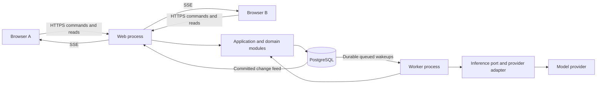
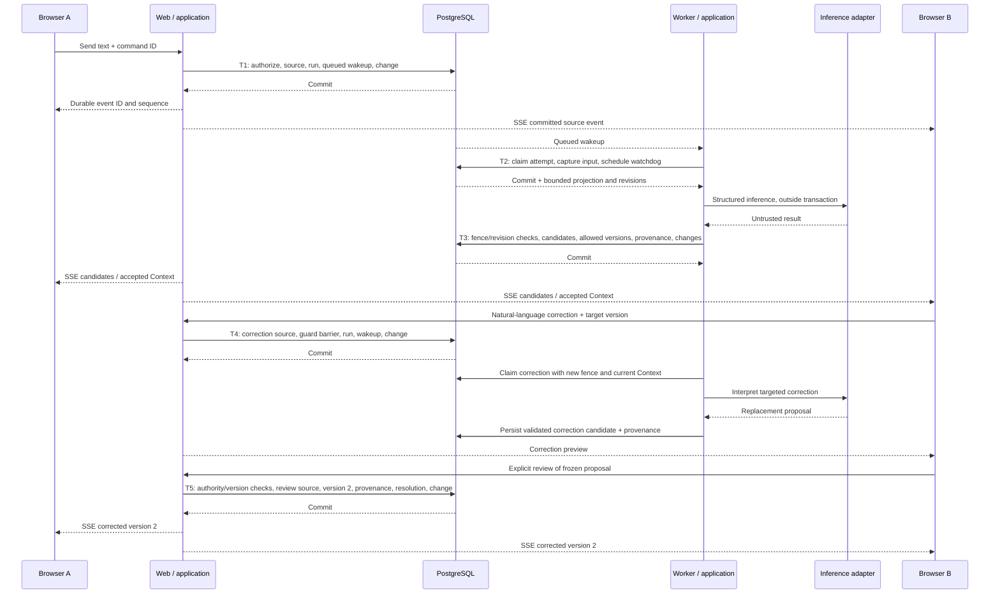

# Allinagent Architecture Proposal v0.1

Status: proposed for review, not approved for implementation. Date: 8 September 2026.

Product authority: [MVP_SPEC_v0.1.md](../product/MVP_SPEC_v0.1.md). Engineering constraints: [AGENTS.md](../../AGENTS.md). Both were read completely. Repository inspection found only those two files, with no application, package configuration or existing stack.

This document recommends implementation choices; it does not amend the product specification. The initial acceptance policy and operating limits below are explicit proposal assumptions, not previously confirmed product requirements. All implementation trees, contracts and commands are illustrative future work.

## 1. Executive Summary

Build a TypeScript modular monolith using Node.js 24 LTS, React and Next.js 16, PostgreSQL 18, Drizzle with node-postgres, Zod, Better Auth, Graphile Worker and server-sent events (SSE). Use the AI SDK behind a small application-owned inference interface. Deploy one web process, one worker process and one managed PostgreSQL database on Render. Web and worker share the same codebase and domain modules.

PostgreSQL owns messages, accepted Context, candidates, provenance and versions. The worker performs asynchronous interpretation. Only application commands can accept a candidate or change canonical state. SSE delivers committed changes; it never owns workspace memory.

Vertical Slice 01 includes authenticated membership, an optional-at-creation but persistent Goal, one Conversation, incremental text processing, candidate review, accepted Context, provenance inspection and natural-language correction with preserved versions. Files, calendar, external actions and Specialist Actors remain subsequent slices within the full MVP scope.

The critical design is a short transactional write boundary per Workspace, immutable source activity and Context versions, optimistic revision checks, and at most one current inference attempt per Workspace. A model call never holds a database transaction open. A submitted correction command immediately invalidates older in-flight interpretations before its replacement is accepted.

The cost of this simplicity is bounded inference throughput within one Workspace, conservative revalidation of candidates, and approximately one-second realtime delivery under normal conditions. These are acceptable starting trade-offs for small collaborating groups; message persistence remains available while AI processing is delayed.

## 2. Architectural Principles

1. Preserve Conversation, derived interpretation, canonical Shared Context and history as distinct concepts. The product's distinctions in MVP §§2–6 determine storage semantics.
2. Store current canonical state directly. Retain append-only source activity and version history alongside it. Normal reads do not replay an event log.
3. Give one application command ownership of each transaction. Raw activity, scheduling and delivery records associated with a write commit together.
4. Treat model output as an untrusted proposal. Evidence, confidence and membership do not confer authority; acceptance is a separate domain decision.
5. Use explicit workspace identity everywhere: queries, foreign keys, jobs, context assembly, cache keys and delivery cursors.
6. Serialize short workspace mutations, not human collaboration or network calls. Use fences and revisions for work that crosses asynchronous boundaries.
7. Make retries safe through durable identities and constraints. Assume at-least-once execution and delivery, never exactly-once model invocation.
8. Keep source history stable during corrections. Undo creates a new version; it does not erase an earlier decision or message.
9. Add concrete modules as slices need them. Do not introduce microservices, Kubernetes, Kafka, generic agent orchestration, vector storage, a knowledge graph, full event sourcing or ceremonial CQRS.
10. Security and recoverability begin in Slice 01. The later security-hardening phase in MVP §18 does not defer isolation, authorization or backups.

## 3. Recommended Stack

These are recommendations for the first approved implementation. Pin compatible maintained releases and commit the lockfile during that implementation; this task installs nothing. Node 24 is an LTS line, Next.js 16 is released, and PostgreSQL 18 is supported by the recommended host. Use patched releases, not the original major-release builds. [Node release schedule](https://nodejs.org/en/about/previous-releases), [Next.js 16](https://nextjs.org/blog/next-16), [Render PostgreSQL versions](https://render.com/docs/postgresql-upgrading).

| Area / Choice | Requirement it solves | Why preferable here | Main trade-off | Reversibility |
| --- | --- | --- | --- | --- |
| Language/runtime: strict TypeScript on Node.js 24 LTS | Shared contracts, worker I/O and maintainable agent-assisted changes | One language across browser, application and AI integration; established libraries | Runtime validation is still necessary; CPU-heavy work will need separate execution later | COSTLY TO CHANGE |
| Frontend: React with Next.js 16 App Router, CSS Modules | Conversation, candidate review, provenance and correction UI | Mature component model and one deployable web application | Next.js caching and client/server boundaries require discipline | COSTLY TO CHANGE |
| Backend: Next.js Node-runtime Route Handlers calling framework-independent application services | Authenticated commands, reads and streaming | No separate HTTP backend framework or internal HTTP hop | Long-lived streams require a persistent host; handlers must stay thin | COSTLY TO CHANGE |
| Repository: one package with domain modules and two entry points; pnpm | Fast iteration for one developer and coding agents | Shared contracts and atomic cross-module changes without monorepo tooling | Module boundaries are enforced by imports and review, not separate packages | EASY TO CHANGE |
| Database: PostgreSQL 18 | Relational ownership, history, transactions and concurrency | One durable system also supports the queue and change feed | PostgreSQL availability affects the entire product | FOUNDATIONAL |
| Query layer: Drizzle over node-postgres; reviewed SQL migrations | Typed queries with explicit transactions, composite keys and locks | Keeps SQL and locking visible; supports targeted SQL where needed | Some constraints, RLS and privileged functions require handwritten SQL | COSTLY TO CHANGE |
| Validation: Zod | HTTP contracts, environment configuration and model schemas | Shared runtime schemas with inferred TypeScript types | Structural validation cannot establish truth or permission | EASY TO CHANGE |
| Authentication: Better Auth with database sessions and email/password; Resend for production verification/reset mail | Two real users, revocable sessions and account recovery | Self-hosted identity/session lifecycle, no custom password implementation | Security updates and email configuration remain our responsibility | COSTLY TO CHANGE |
| Client data: TanStack Query plus a small ordered change-feed reducer | Server-state cache, optimistic messages and reconnect | Query invalidation/refetch fits authoritative server state | Must reject old versions and deduplicate optimistic acknowledgements | EASY TO CHANGE |
| Realtime: same-origin SSE, durable PostgreSQL change feed, HTTP writes | Updates to both browsers and recovery after disconnect | Required server-to-client direction fits SSE; no broker or socket service | Open connections and indexed polling consume web/DB capacity | EASY TO CHANGE |
| Background work: Graphile Worker using the same PostgreSQL database | Durable scheduling, delayed wakeups and infrastructure retries | Enqueue through SQL in the source transaction; no Redis | Queue and product share database capacity; application idempotency is still required | COSTLY TO CHANGE |
| AI integration: AI SDK Core behind an owned port; one direct Anthropic adapter initially | Structured extraction without provider concepts in the domain | Reuses provider protocol handling while keeping our task contract stable | SDK and model upgrades require contract/quality checks; no automatic cross-provider fallback | EASY TO CHANGE |
| Files later: private Amazon S3 bucket accessed through a small storage adapter | Durable uploads with application-controlled access | Standard object storage; metadata and permissions remain relational | Signed URL expiry, scanning and retention need an ingestion slice | EASY TO CHANGE for adapter; COSTLY TO CHANGE once substantial data exists |
| Tests: Vitest, React Testing Library and Playwright; real PostgreSQL integration databases | Rules, database races, contracts and two-browser behavior | Fast pure tests plus realistic transaction and isolation checks | Integration/E2E tests require PostgreSQL and a running worker | EASY TO CHANGE |
| Local development: Node/pnpm on host, one PostgreSQL container | Simple checkout-to-running workflow | Mirrors database behavior with no local broker or cloud emulators | Docker is needed for the documented database setup | EASY TO CHANGE |
| Deployment: Render web service + background worker + managed PostgreSQL, same region | Persistent SSE, durable worker and managed backups | Three managed components; one application release | Higher fixed baseline than a sleeping demo; vendor operational dependency | EASY TO CHANGE with a planned database migration |
| Observability: structured Pino logs, application metrics and Sentry errors; OpenTelemetry-compatible trace IDs | Trace a message through inference, commit and delivery | Useful diagnostics without hosting an observability cluster | Third-party telemetry must exclude private payloads | EASY TO CHANGE |

Drizzle supports explicit transactions; use its transaction client for every statement in a command, including queue scheduling. Better Auth supports database sessions and a Drizzle adapter; disable its session cookie cache initially so revocation is not delayed by cached identity. Keep its CSRF protections and explicit trusted origins enabled. [Drizzle transactions](https://orm.drizzle.team/docs/transactions), [Better Auth installation](https://better-auth.com/docs/installation), [session management](https://better-auth.com/docs/concepts/session-management), [security options](https://better-auth.com/docs/reference/options).

Select the lowest-cost model in the initial adapter that passes the versioned Italian extraction/correction fixtures. Model identifier, token limits and task profile are deployment configuration, recorded in inference diagnostics. Exact model selection is reversible and does not block the data model. The AI SDK supports schema-based output and provider registration; neither replaces application validation. [Structured output](https://ai-sdk.dev/docs/reference/ai-sdk-core/output), [provider management](https://ai-sdk.dev/docs/ai-sdk-core/provider-management).

## 4. System Architecture



The web process owns authentication, HTTP boundaries and delivery. The worker owns asynchronous execution. Both use the same application commands, validation rules and persistence adapters. They are two execution modes of one modular monolith, not independently owned services.

Use one primary database and three schema areas: authentication-owned tables, application tables, and Graphile's operational schema. The queue has no domain authority. Normal application queries never read Graphile internals to determine whether Context is accepted.

No worker calls the web API to update Context. It calls the shared application service directly. No browser accesses PostgreSQL or provider credentials. No web handler performs an AI call after returning an HTTP response as an informal substitute for a job.

## 5. Domain Boundaries

| Module | Owns now | Permitted dependencies / boundary |
| --- | --- | --- |
| Identity adapter | Library-managed accounts and sessions; `AuthenticatedUser` | Exposes identity, never project authority |
| Workspaces | Workspace lifecycle, members, invitations | Provides authorized workspace scopes; membership administration is distinct from Context authority |
| Conversation | Append-only source events and timeline queries | Creates processing requests for supported human events; does not interpret them |
| Context | Goal commands, candidates, acceptance rules, items, versions, correction and provenance | Owns all canonical Context mutations; does not import provider SDKs |
| Context processing | Incremental task scheduling, relevant-input assembly, inference attempts | Calls the inference port, then Context commands; cannot directly set accepted state |
| Collaboration policy | Small pure rule set inside Context initially | Classifies required confirmation and verifies existing authority at commit; no configurable policy engine |
| Delivery | Workspace changes and authorized SSE catch-up | Reads committed records; cannot mutate domain state |
| Infrastructure | PostgreSQL/Drizzle, Graphile, authentication, AI SDK and telemetry adapters | Implements narrowly defined ports; no generic repository or service-locator framework |

Use plain functions and explicit dependencies. Domain rules have no HTTP request, React, SDK response or database connection types. Application services coordinate repositories inside one transaction. Repositories own concrete queries; do not create one generic CRUD abstraction for every entity.

Boundary enforcement belongs in import restrictions and tests: browser code cannot import server modules; domain code cannot import infrastructure; modules expose intentional application functions. A worker must use `acceptCandidate` or `applyCorrection`, not duplicate their SQL.

## 6. Source / Derived / Canonical / History Model

| Category | Representation | Mutation rules |
| --- | --- | --- |
| Source activity | Human messages, correction requests, explicit review actions, relevant Miriam/system messages | Append-only records. Later interpretation never changes their body, author or ordering |
| Derived/inferred | Inference results, candidates, candidate status, relevance classification | May be rejected, invalidated or replaced. Candidate proposed content is immutable; a different proposal receives a new ID |
| Canonical | Context item identity and pointer to its accepted current version; Workspace membership and lifecycle | Changes only through validated commands under authority and concurrency checks |
| History | Immutable Context versions, provenance links, source review/correction events | New transitions append versions; old ones remain inspectable |
| Operational | Inference runs/attempts, queued jobs and realtime change feed | Supports execution and delivery. Does not determine product truth |

A Context item has stable identity. Its current pointer chooses an immutable version holding the accepted content and status. Thus the current value is not duplicated in an independently editable JSON snapshot. A version also represents the item's state transition: previous version, transition type, cause, rationale, actor and policy basis. A separate generic `StateTransition` table is unnecessary now.

Correction is an appended request followed by a proposed or authorized replacement version. Supersession within an item means advancing its current pointer; supersession by a different item can reference that replacement item. Retraction creates a new retracted version. Restore/undo creates another version with a link to the version being restored. None rewinds counters or deletes provenance.

Keep acceptance separate from alignment: an accepted Context item may truthfully record an unresolved Open Question or a contested Decision. `candidate.status = accepted` does not mean `decision.alignment = settled`.

Append-only applies to ordinary product operations. A future authorized retention/redaction process must explicitly account for raw text, versions, AI inputs and backups. Do not promise irrevocable retention of private content, and do not implement normal corrections as erasure.

## 7. Initial Relational Data Model

### Common conventions

Use UUID identifiers, UTC `timestamptz`, integer version numbers and `bigint` ordering/revision counters. Serialize bigint cursors as decimal strings in HTTP/JSON. Do not use client timestamps, UUID order or a global database sequence as workspace commit order.

Every workspace-owned row carries `workspace_id`. Every relationship between workspace-owned entities uses a composite foreign key including `workspace_id`, backed by the corresponding unique key. Do not rely on globally unique IDs alone for isolation. Use restricted deletion rules for source/provenance/history, not cascading deletion during normal edits.

Canonical state uses typed columns. JSONB is allowed for bounded, versioned inference input/output envelopes and diagnostic manifests, where the shape is an integration contract; it is not the store for membership, Goal, Context lifecycle or authority.

### Entities

| Entity / classification | Purpose, ownership and important fields | Relationships, constraints and indexes |
| --- | --- | --- |
| `auth_user`, library `session`, `account`, `verification` / identity | Better Auth owns credentials and sessions. User ID, display name, email/verification, timestamps; domain references user ID | Keep library-required constraints/migrations. Never expose tokens/password data to workspace queries or models. A duplicate domain User table is unnecessary |
| `workspace` / canonical + coordination metadata | Workspace owns `id`, `name`, `created_by`, `lifecycle`, `activity_seq`, `change_seq`, `state_revision`, `guard_revision`, `membership_revision` | Row is the short mutation lock. `state_revision` changes for canonical Context transitions; `guard_revision` also changes for correction barriers/membership changes. Counters are server-managed, nonnegative |
| `workspace_member` / canonical access | Workspace owns `workspace_id`, `user_id`, `access_role` (`owner`/`member`), `status`, joined/left times | Unique `(workspace_id,user_id)`; index `(user_id,status,workspace_id)`. Retain former membership for history. Owner manages access, not all project decisions |
| `workspace_invite` / access operational | Scoped, expiring invitation: token hash, inviter, expiry, consumed/revoked timestamp, consuming user | Unique token hash; scoped inviter/member link. Single-use redemption under workspace lock. Token is not an ongoing workspace credential |
| `source_event` / source + historical user actions | Workspace owns `id`, `seq`, `kind`, `actor_kind`, optional `actor_user_id`, `body_text`, `created_at`, `command_id`, `command_hash`. Optional typed `reply_to_event_id`, `target_item_id`, `expected_item_version`, `target_candidate_id`, `review_action`, `resolves_event_id`, `caused_by_run_id` | Unique `(workspace_id,id)` and `(workspace_id,seq)`. Unique command identity per actor/workspace with a request hash; same key/different body is a conflict. Actor/kind checks. Scoped links to candidate/item/events. Index candidate reviews by `(workspace_id,target_candidate_id,actor_user_id,seq)` |
| `inference_run` / operational logical task | One extraction/correction task for a source event: `id`, `workspace_id`, `source_event_id`, `task_kind`, `task_version`, `status`, `attempt_no`, `retry_cycle`, `calls_in_cycle`, `lease_until`, `next_attempt_at`, `review_only`, `last_error_code`, created/finished timestamps | Unique `(workspace_id,source_event_id,task_kind,task_version)`. Partial unique index on `workspace_id` while `status='running'`. Status: queued, running, retry_wait, completed, failed. Index nonterminal runs by workspace/source event. Attempt number is a fencing token, not model confidence |
| `inference_attempt` / operational history | Run attempt: `run_id`, `attempt_no`, status, captured guard/state revisions, source cutoff, prompt/schema/task versions, configured model/provider, input hash, bounded input manifest/envelope, validated output envelope, timings, token usage, error category | Unique `(workspace_id,run_id,attempt_no)`; FK to run. Attempt identity/input stay immutable; only terminal outcome fields finalize. Payload access is restricted and retention-bounded |
| `context_candidate` / derived or explicitly proposed | Immutable proposed operation: `id`, `origin_event_id`, `origin_kind` (human/inference), optional `run_id` and `attempt_no`, `ordinal`, `kind`, `operation`, `target_item_id`, `expected_version`, `proposed_text`, `proposed_alignment`, `rationale`, optional `reported_confidence`, `inferred_guard_revision`, `review_membership_revision`, `status`, `required_review`, `accepted_version_id` | Unique `(workspace_id,run_id,attempt_no,ordinal)` for inference; unique `(workspace_id,origin_event_id,ordinal)` for human proposals. Scoped source/target/attempt links and an origin-shape check. Status: pending, needs_input, accepted, rejected, stale. A status update cannot alter proposal text or its basis |
| `context_item` / canonical identity | Workspace-owned `id`, `kind`, `current_version_no`, created timestamp | Kinds initially `goal`, `decision`, `constraint`, `fact`, `open_question`. Unique `(workspace_id,id)` and `(workspace_id,id,kind)`. Partial uniqueness for one Goal item per workspace. Deferred composite FK to its current version; no committed item without a version |
| `context_version` / canonical value + immutable history | `item_id`, `version_no`, `kind`, `text`, `lifecycle`, `alignment`, `previous_version_no`, `transition_kind`, `cause_event_id`, optional candidate, `performed_by_kind/user`, `authority_basis`, `policy_version`, `rationale`, `state_revision`, `created_at`, optional `superseded_by_item_id` / `restores_version_no` | PK `(workspace_id,item_id,version_no)`; scoped links to item/previous version/cause/candidate. Version 1 has no predecessor; subsequent versions reference N−1. Unique accepted candidate reference prevents double acceptance. Index `(workspace_id,state_revision)` |
| `provenance_link` / source and history links | Workspace-owned link from exactly one candidate OR Context version to exactly one source event OR immutable Context version; `relation` (supports, corrects, contradicts, authorizes), optional exact source-text offsets | XOR checks for owner and source; scoped FKs; uniqueness of each owner/source/relation tuple; indexes in both directions. Accepted versions require a causal raw event and valid supporting/correction lineage. Offsets are validated against the immutable source body |
| `workspace_change` / durable delivery | Small committed envelope: `workspace_id`, `seq`, `kind`, optional `source_event_id`, `context_item_id` + version, `candidate_id`, `run_id`, current state revision, timestamp | PK `(workspace_id,seq)`; typed subject checks/FKs for each kind. Append in the transaction that changes its subject. It contains references, not a second copy of the entire workspace |

There are eleven application entities above plus authentication-owned tables and Graphile's own schema. Each application entity serves Slice 01: invitation security, asynchronous retries, reviewable inference, immutable Context and resumable delivery. No placeholder entity represents a future feature.

Use text fields with explicit checks for evolving domain enums rather than an opaque JSON payload. Migrations can widen supported kinds. Enforce mandatory version provenance with a deferred constraint check at transaction completion, plus application validation before inserts; candidate/version/provenance insertion order must remain possible within one transaction.

An explicit human Goal/edit proposal does not require a fabricated AI run. Its candidate references the original command event; inference-generated candidates additionally require a real attempt. Source command uniqueness includes actor kind and treats a null system/Miriam user ID as a comparable value, so system retries cannot bypass deduplication through SQL null semantics.

Provenance targets only source events and already-existing immutable Context versions, never mutable current pointers or the newly created version itself. Validate supporting references against the captured input and keep the previous version's original support alongside the new correction/authorization links. A correction's rationale is an inspectable explanation, not stored hidden model reasoning.

`ContextVersion` serves as the first Decision transition record: outcome is its text, alignment is typed, and rationale/provenance/previous state are preserved. Slice 01 does not claim to compute the complete Decision consequence graph. Future structured consequences can reference these immutable version IDs.

### Concepts without a separate table yet

- **Goal:** a Context item with dedicated Goal commands, a unique-per-workspace identity and version history. Its required semantics are not implemented as arbitrary Notes. Absence of an initial Goal is allowed; Goal-dependent inference waits or asks for one.
- **Conversation:** one primary timeline is scoped directly to the Workspace. Semantic Workstreams later link existing events; they do not require creating conversations or relocating messages.
- **Shared Context:** the set of accepted current Context versions, not a singleton JSON document.
- **StateTransition:** represented by typed immutable Context versions for this slice.
- **Candidate reviews:** explicit immutable `source_event` records, queried per candidate and member. Store the latest approve/reject/withdraw response by sequence, not one mutable approval flag. These are historical human acts, not derived authority inferred from chat.
- **Current State, Catch-up, Evidence objects, Tasks, Artifacts, Workstreams, Sub-goals, Actor registry and Active Work:** no tables until their own slice needs them. Operational inference runs are not the future product Active Work model.
- **Vector embeddings, knowledge graph and generalized workflow definitions:** absent.

## 8. Event Model

Use `source_event` for what happened, `workspace_change` for what clients need to fetch, and `inference_run` for work to do. They have different retention, security and idempotency semantics.

| Event kind | Meaning | Processing behavior |
| --- | --- | --- |
| `human_message` | Authenticated user's original text | Enqueue bounded relevance/extraction work |
| `correction_requested` | Original natural-language correction; target/version if supplied | Establish correction barrier synchronously; enqueue correction interpretation |
| `candidate_reviewed` | Explicit review of an immutable proposal | Run deterministic acceptance logic; do not infer consent again from the review event |
| `goal_requested` / `context_edit_requested` | Explicit structured command with original text | Create a proposal or execute an already-authorized exact edit through Context rules |
| `correction_resolved` | Accepted correction or explicit dismissal/clarification resolving a prior request | Close barrier; preserve the original request |
| `processing_retry_requested` | Explicit retry of a failed interpretation | Starts a new bounded retry cycle on the existing logical run; preserves all earlier attempts |
| `miriam_message` | Relevant conversational contribution or clarification | Persist if shown as conversation; do not automatically feed it back into extraction |
| `workspace_event` | Membership or meaningful system activity | Only specifically supported subtypes affect processing; no recursive generic trigger |

Message body is plain text in Slice 01; render it safely. Stable command fields are typed columns, not executable instructions. Future file events point to file records while keeping the original event ID stable.

The primary correction path opens from a Context item (or an explicit correction action in the composer) and sends natural-language text as `correction_requested`; this supplies synchronous intent and optional target metadata without requiring a rigid replacement form. An unmarked ordinary message may only be recognized as corrective asynchronously. In that case, retain the original `human_message`, record the detected interpretation as a proposal with source provenance, and establish a correction barrier when offering the correction for review. Do not retrospectively relabel raw history or claim the request-time barrier existed before intent was recognized. The user-visible correction guarantee starts at the explicit correction command/barrier, not at an unknowable semantic instant inside arbitrary chat.

Allocate `activity_seq` while holding the Workspace row lock. Allocate change-feed sequences from `workspace.change_seq` under the same lock. Multiple records in one transaction receive a contiguous block. A rolled-back transaction exposes none of them. This prevents an earlier allocated ID from committing after a client has advanced past it.

Client commands carry a random `command_id`. Store the normalized request hash. A duplicate command returns its durable event/result after checking current authorization. A reused key with different content returns `409 Conflict`. Source ID deduplication does not attempt to infer that two independently sent human messages mean the same thing.

## 9. Incremental Context Engine

### Processing one new event

1. **Receive and validate.** Authenticate, validate body/size with Zod, establish workspace scope and verify active membership. Author and sequence come from the server.
2. **Transaction T1: source and scheduling.** Lock Workspace; recheck membership and command identity. Insert source event, increment activity sequence, create the unique logical inference run and insert the conversation change. Enqueue a `process_workspace_context` wakeup through Graphile SQL in this same transaction. Commit before replying to the browser.
3. **Durable wakeup.** A job payload contains only the workspace ID and protocol version. The handler loads the actual work from scoped database rows. Wakeups can duplicate; they are not canonical processing state.
4. **Transaction T2: claim and capture.** Lock Workspace, find an eligible run, and claim it by incrementing `attempt_no`, setting `running` and a lease. Create its immutable attempt input record. An existing unexpired running attempt prevents another claim. Capture canonical state and `guard_revision` consistently in this short transaction. Commit.
5. **Asynchronous boundary.** Assemble the prompt from the captured bounded inputs and invoke the provider outside the database transaction. No database connection or lock remains reserved for model latency.
6. **Structural validation.** Accept only a complete schema-valid response. Refusals, truncated output, unknown fields, over-limit collections and malformed values are failures, not an empty successful result.
7. **Application validation.** Validate workspace-scoped references, input membership, exact source spans, target versions, permitted operations and coherence with task purpose. Compute required review on the server. Model claims about authority, consensus or risk cannot authorize a write.
8. **Transaction T3: proposals and optional state.** Lock Workspace, reload the run, and require matching running status, attempt token, unexpired lease and captured guard revision. Verify all target versions and authority again. Insert candidates and their provenance. Evaluate the acceptance policy. For allowed candidates, append canonical versions/provenance, update current pointers and increment state/guard revisions.
9. **Complete atomically.** In T3 also append candidate/Context delivery changes, mark the run completed and enqueue continuation for remaining runs. Commit. Only now is any Context update authoritative.
10. **Delivery.** SSE picks up the committed change feed. Both clients see a pending candidate, accepted change, correction preview or meaningful processing problem as appropriate. An automatic acceptance has visible micro-feedback and an undo action.

Graphile supports durable at-least-once jobs and transactional SQL enqueueing. Its job key is not an application idempotency guarantee. Use a narrow privileged enqueue wrapper for the fixed task name and scoped workspace ID, not a database-owner web connection. [Graphile reliability](https://worker.graphile.org/docs), [SQL enqueue API and privileges](https://worker.graphile.org/docs/sql-add-job).

### Minimum relevant Context

For Slice 01, assemble the triggering event, its directly referenced/replied-to source, the current Goal, the explicitly targeted item and its relevant versions, applicable pending correction, and a bounded selection of current Context plus neighboring conversation. Start with at most 12 preceding messages, 20 relevant Context versions and an 8,000-input-token budget. These are tunable limits, not promises of semantic completeness.

Prefer deterministic selection: explicit references first, Goal and Constraints next, then lexical relevance and recency using PostgreSQL queries. Preserve item kind, accepted/proposed/contested status, version and provenance in the projection. Never flatten everything into an unlabeled prose summary. Do not let arbitrary source text become a system instruction.

Record the exact selected IDs/versions and truncation decisions in the attempt manifest. Explicit correction targets cannot be silently truncated; if they exceed the budget or the referent is missing, return Needs Input. A relevant-input task can later replace selection heuristics without changing canonical storage.

Process only the new event as the extraction subject. Neighboring events provide interpretation context, not permission to re-extract the entire window on every message. Every new candidate needs support from the triggering event; prior sources may supplement it. When a Goal is absent or relevance is uncertain, preserve the raw event and avoid unsupported canonical updates. Cheap relevance classification may produce `off_goal` with no candidates; do not discard source activity.

### Structured inference contract

```text
ContextInferenceV1 {
  schemaVersion: 1
  relevance: "relevant" | "off_goal" | "unclear"
  clarification: string | null
  candidates: [max 8] {
    kind: "decision" | "constraint" | "fact" | "open_question"
    operation: "create" | "correct" | "supersede" | "retract"
    targetItemId: UUID | null
    expectedVersion: positive integer | null
    proposedText: nonempty bounded string
    proposedAlignment: "proposed" | "settled" | "contested" | "unclear"
    rationale: bounded string
    reportedConfidence: number in [0, 1]
    supportingSources: [1..8] { eventId, startOffset, endOffset }
    referencedContextVersions: [0..8] { itemId, versionNo }
  }
}
```

The model cannot return `workspaceId`, `accepted`, a user/agent authority grant, SQL, an executable action or a provider-dependent domain type. Server code attaches identities. Goal changes use a dedicated command/confirmation path; extraction may suggest clarification rather than mutate the Goal.

### Acceptance and confirmation boundary

The following is a **proposed conservative Slice 01 baseline** for review:

| Proposal | Initial acceptance rule |
| --- | --- |
| Verbatim explicit Open Question with no commitment or state replacement | May auto-accept only after evidence checks, no duplicate/current conflict, no correction barrier and a narrow server-owned low-risk allowlist. If risk or meaning is uncertain, leave pending |
| Fact/Information or other inferred Open Question | Requires explicit review by an active member. The accepted record identifies who confirmed it and its source; it does not claim unanimous agreement |
| Decision, Constraint, Goal change, consequential or destructive transition | Requires explicit approvals from all current active members for the same frozen candidate and expected version, unless a later approved authority policy supplies a valid scoped grant |
| Correction to low-impact informational content that does not revise a group-confirmed consequential state | Any member can request and confirm the replacement; inferred meaning is previewed first. An exact user-specified replacement with unambiguous target can use the direct authorized command path |
| Correction changing a group-confirmed decision/constraint/Goal or its consequences | Preserve the current state until group confirmation; label disagreement rather than silently choosing a value |

This initial auto-acceptance path is intentionally narrow. A model confidence score or asserted `settled` alignment is never enough. The application conservatively classifies everything outside the question allowlist as requiring review. Model-based fact automation can be expanded after calibration without changing this storage design.

For automatic Open Questions, require a create operation, an exact complete question span in the triggering human message and no inferred replacement or commitment. The item records that the named member asked that question; it does not assert the question's premises as facts or declare a group priority. Questions whose significance or interpretation is uncertain require review. This avoids treating the question “Quando apriamo il locale già scelto?” as proof that a location has been chosen.

Each candidate freezes its proposal, target version and membership revision. Review records bind to that identity. Rejection/withdrawal is explicit; silence never counts. A membership change or relevant revision change invalidates approvals instead of making a previously insufficient vote sufficient. Workspace creation may establish an explicit initial Goal while its creator is the sole member; later joiners see existing state, not fictitious retroactive consent.

### Ordering, leases, retries and failures

Graphile is the queue; a small application-level claim rule protects sequential understanding within a Workspace. Do not depend on job arrival order or a process-local mutex. Under the Workspace row lock, claim the oldest nonterminal correction run first, then the oldest ordinary run by source sequence. A retry-waiting earliest run waits until its due time; later ordinary runs do not bypass it. Pending human review does not keep an inference run running.

At claim time, first inspect any running run. If its lease is live, make no new claim. If expired, finalize its old attempt as abandoned and return that run to queued before selecting the next run; this releases the partial unique constraint. Only then select, increment the chosen run's fence and claim it. Old callbacks may record their own late diagnostic outcome but must not clear a newer lease, change a newer attempt or enqueue another retry for it.

Start with a 45-second provider timeout and 90-second attempt lease. T2 schedules a watchdog wakeup at lease expiry in the same transaction as the claim. If a worker disappears, a later handler can reclaim the expired run with a higher attempt token. A delayed result from the old attempt cannot commit. Use two global concurrent model calls initially; different Workspaces can progress independently.

Known provider failures are recorded and retried with bounded application-level attempts: three calls per retry cycle with delays of 5 and 30 seconds plus jitter, honoring a longer provider `Retry-After`. Reserve the call budget in T2 before network I/O; timeouts, abandoned calls and stale results count toward it as well. Disable hidden SDK retries or include them in that budget. A schema failure permits one fresh schema-constrained retry within the same budget; do not repair arbitrary text into accepted state. A non-retryable credentials/configuration error fails fast and alerts the operator.

Known failures update the run and enqueue its delayed wakeup transactionally; acknowledge the current wakeup. Graphile's retries handle unhandled crashes/DB errors, not a second invisible provider-retry loop. Run/attempt records cap calls even after repeated wakeups. At exhaustion, mark failed, retain source and any previous canonical state, emit a concise retryable processing-status change and let later runs proceed. A terminal failure is not recorded as `off_goal` or as successful understanding.

An explicit retry records its source command, reopens the same logical run with a new retry cycle and `review_only=true`, and resets only that cycle's call budget. The monotonically increasing attempt fence is never reset. It does not erase failed attempts or automatically promote interpretations from old source into newer truth. Repeated guard invalidation can exhaust a cycle with a distinct `repeatedly_invalidated` status reason rather than silently calling forever. Periodic reconciliation in the existing worker re-enqueues due nonterminal runs whose wakeups were lost/exhausted. Queue-level metadata may be cleaned independently of durable run results.

Observability records correlation ID, workspace/run/attempt identifiers, queue delay, selected-input counts, latency, token usage, validation failures, retries, stale discards, lease recovery and committed version IDs. Do not log prompt bodies or raw model text to general logs. Restricted attempt payloads are for reproducibility, with an explicit retention limit; canonical provenance outlives them.

## 10. Concurrency & Consistency

Use PostgreSQL `READ COMMITTED` for commands, with a Workspace row lock acquired first for every workspace mutation. Lock dependent item/run rows in a consistent order afterward. After acquiring the lock, re-read membership and any expected versions; never act on pre-lock reads. Pure snapshot/catch-up reads use a short repeatable-read transaction when a consistent cursor and state must be returned together. [PostgreSQL row locks](https://www.postgresql.org/docs/18/explicit-locking.html).

| Case | Expected behavior | Consistency mechanism |
| --- | --- | --- |
| A. Two humans send nearly simultaneously | Both messages persist; each receives a definitive per-workspace sequence. Neither replaces the other | Short Workspace row lock, monotonic transactional sequence, unique command identity |
| B. Two Context Engine jobs overlap | Only one current attempt is claimed per Workspace. A second wakeup returns or schedules a later wake; an expired older attempt can still compute but cannot commit | Partial unique running-run constraint, lease, monotonically increasing attempt fence and final transaction checks |
| C. Correction arrives during older inference | Correction request persists immediately and establishes a barrier. Older output cannot silently overwrite it, even before a corrected version exists | Synchronous guard increment; older unfinished runs become review-only; old pending candidates become stale; final guard comparison; correction-priority processing |
| D. Commit succeeds but acknowledgement fails | Retry finds the completed run/accepted candidate and returns the durable result. No duplicate version or micro-feedback event | Transactional run completion, unique candidate/acceptance constraints and command idempotency |
| E. Client writes from stale state | Return `409` with current authorized version; retain the user's draft and ask them to review/reapply | Expected item version and candidate revision; no last-write-wins overwrite |

`state_revision` orders canonical Context transactions. `guard_revision` invalidates interpretation and review when canonical state, pending corrections, membership or applicable policy changes. Ordinary message insertion only advances activity/change counters; it does not continuously invalidate a running model call. Sequential processing supplies ordinary conversational continuity.

### Correction barrier details

In the correction request transaction, increment the guard and set `review_only` on older unfinished runs. Mark older pending candidates stale. The pending correction is represented by its immutable source request without a corresponding explicit resolution event. While any such request is unresolved, disable automatic Context acceptance in that Workspace; this broad barrier is conservative and can later become target-scoped.

An in-flight result with a mismatched guard is retained as a stale diagnostic attempt, creates no accepted change and is scheduled for fresh interpretation within its remaining budget. The next claim prioritizes the correction. An ambiguous target produces Needs Input; it does not guess or clear the barrier. Its inference run completes while the correction request remains unresolved, so unrelated ordinary interpretation may continue with automation disabled. A confirmed correction or explicit user dismissal appends `correction_resolved` and advances the guard again. Older runs remain review-only after the barrier closes.

Failure handling, stale-result handling and lease recovery use the same guarded transaction discipline as success: a callback changes run state only if its attempt is still current. A missing correction target cannot disappear merely because its provider call failed; the original request stays open until a human resolves or dismisses it.

Candidate acceptance also rechecks its guard, expected target version, review-only status and membership revision. A stale candidate cannot be approved by simply updating its saved revision: fresh interpretation creates a new candidate and invalidates old reviews. Initially, even unrelated canonical changes may force this conservative refresh. If an automatic acceptance in a batch advances the guard, remaining unaccepted candidates in that batch may require refresh as well; do not silently rebase their meaning.

For duplicate-looking creations from different messages, show the existing item to the inference task and reject exact normalized duplicates deterministically. Semantic equivalence is not a database uniqueness fact: ambiguous duplicates remain proposed for review, not silently merged.

A transition may affect several Context items later. Their versions share one state revision and commit atomically. SQLite-style test substitutes, timestamps as locks and queue-provider claims of exactly-once processing are insufficient for these guarantees.

## 11. Realtime Model

| Layer | Responsibility |
| --- | --- |
| PostgreSQL domain tables | Durable original events and accepted/pending state |
| `workspace_change` | Ordered replayable references to committed changes |
| SSE over authenticated HTTPS | At-least-once transport of those changes |
| TanStack Query and local UI | Disposable cache, pending drafts and optimistic presentation |

Expose a same-origin workspace stream and a paginated changes endpoint using the same feed. Use HTTP commands for writes. Poll indexed `workspace_change` rows approximately once per second while a stream is active; use short queries, never a database transaction held for the lifetime of an SSE connection. Send heartbeat comments about every 15 seconds and close idle/slow streams with bounded output buffers.

SSE supplies event IDs and automatic reconnect behavior. Application code still owns durable recovery. Persistent Next.js hosting supports streaming, but reverse-proxy buffering must be disabled and verified on the deployed path. [SSE behavior](https://developer.mozilla.org/en-US/docs/Web/API/Server-sent_events/Using_server-sent_events), [Next.js self-hosted streaming](https://nextjs.org/docs/app/guides/self-hosting).

### Recovery protocol

1. Fetch an authorized bootstrap snapshot containing the recent Conversation page, current Context/candidates and a change cursor from the same repeatable-read snapshot.
2. Open SSE with that cursor. Select `seq > cursor ORDER BY seq`, with a bounded batch size. Never jump the cursor directly to the database's maximum without reading intervening records.
3. Process changes in order. Source events deduplicate by ID/sequence and reconcile optimistic messages by command ID. Context reads apply only equal/newer versions; late responses cannot regress the cache.
4. Advance the application cursor only after processing the batch. Use a reconnect wrapper with the last successfully applied cursor; native EventSource's last received ID alone is not proof that the application applied the change.
5. On transient failure, reconnect and replay; duplicates are harmless. On reload or workspace switch, fetch a fresh consistent bootstrap. Keep separate cache keys and cursors per Workspace and clear them on logout.
6. If the cursor is outside retention or ahead of the restored database, send `reset_required` and bootstrap again. A pruned feed does not imply deleted messages or Context history.

Candidate/run query responses also carry an `asOfChangeSeq` from their read snapshot. Keep a per-resource cache watermark, advanced when a change for that resource is observed, and reject older responses. Otherwise an old HTTP response could turn an accepted candidate back into pending even though Context item version checks are correct. A resource watermark must never advance the global applied-feed cursor: other resources may still have unapplied changes.

Retain the change feed for an initial 30-day recovery window, adjustable with measured growth. Catch-up later uses Context history, not this expiring transport log. At each outgoing data batch, validate the session and current membership against the database; revoked/expired access closes the stream. Authorization is judged at the batch read boundary; already delivered data cannot be recalled.

Return workspace snapshots, changes and streams with private, no-store cache policy. Do not put personalized workspace reads in Next.js shared caches or CDN caches. Authorization in a page component is not a substitute for checking the underlying Route Handler and subsequent stream batches.

Poll cost grows with connected clients. Measure it first. A later shared per-workspace poller or PostgreSQL notification can wake the same replay query without changing its durable cursor contract. Notifications would remain hints, not delivery guarantees. No CRDT is needed for append-only messages and versioned Context edits; collaborative Artifact editing is a later design.

## 12. AI Integration Boundary

```text
Application task: interpretNewEvent(AuthorizedWorkspaceScope, run)
  -> ContextAssembler: scoped immutable InputProjection
  -> InferencePort: inferContext(InputProjection, TaskProfile)
  -> AiSdkAdapter: protocol, deadline, structured-output invocation
  -> configured provider/model
  -> integration schema validation
  -> application reference/meaning/authority validation
  -> Context commands in a fresh guarded transaction
```

The **domain** owns Context kinds, alignment, transitions, provenance requirements, correction semantics and authority. The **application** owns the task definition, budgets, selected inputs, idempotency and acceptance boundary. The **AI integration** owns prompt formatting, provider authentication, schema mapping, SDK errors and normalized usage metadata.

Use one owned `ContextInferencePort`, not an `Agent` base class. `TaskProfile` identifies an extraction/correction contract and its limits; deployment configuration maps it to one provider model. The domain does not contain provider enums, provider conversation IDs, model response classes or a provider-hosted memory store.

Only deterministic test doubles or configured adapters satisfy the port. Partial streamed model output never enters canonical state. No tools or external-action capabilities are exposed to this Slice 01 extraction call. Refusals are distinguishable from successful empty candidate lists. No silent vendor fallback sends workspace data to an unreviewed recipient.

InputProjection includes epistemic labels and provenance, not just strings. This is the future seam for minimum-necessary Context Projection and Specialist Contributions, while MVP §12's actual actor system remains unimplemented.

## 13. Authorization & Workspace Isolation

### Authentication and access

Better Auth owns account/session validation. Use secure HttpOnly cookies on the same origin, explicit trusted origins and CSRF checks for state-changing endpoints. Verify production email addresses before accepting invitations. Do not roll our own password hashing or account recovery. Domain services receive an authenticated user ID, not an unverified client-supplied identity.

An authenticated user can create a Workspace. Join uses an expiring, single-use random invitation token stored only as a hash. The inviter must be an active owner; redemption locks the invitation/workspace and creates membership once. Knowing a workspace UUID is not permission to join. Listing workspaces derives from the requesting user's active memberships.

All reads and writes verify membership server-side. For mutations, recheck after acquiring the Workspace lock so revocation and writes have a defined order. Return a consistent not-found response for inaccessible workspace resources; do not expose cross-workspace IDs through detailed foreign-key errors.

### Database boundaries

Use an explicit `withWorkspaceTransaction(authenticatedUser, workspaceId, fn)` application boundary. It starts the transaction, sets transaction-local workspace scope, verifies active membership, then exposes scoped repositories. A narrow membership lookup is allowed before the domain callback; arbitrary queries are not. Workspace listing uses a separate identity-scoped membership query. Creation and invitation redemption have narrowly defined bootstrap paths.

Make those bootstrap exceptions concrete: `workspace_member` has a self-read policy allowing a verified transaction user to enumerate only their own memberships; workspace summaries are then loaded under each authorized workspace scope. A restricted invitation-lookup function accepts only the full token hash and returns the candidate workspace ID, not its contents. Redemption establishes that scope and rechecks token validity and owner/membership conditions under the Workspace lock. Creation scopes a newly generated workspace ID and atomically creates its owner membership; it cannot reuse an existing Workspace. These paths do not disable tenant policies for ordinary queries.

Enable and force RLS on workspace-owned tables as defense against missing tenant predicates. Ordinary read/write policies require the transaction's workspace ID; the explicit own-membership discovery exception above is read-only and requires verified user scope. Missing required scope fails closed. Use `SET LOCAL`/transaction-local settings, never connection-global tenant state. RLS here enforces the tenant fence; membership and domain authority are checked by application services. Setting a workspace variable is not itself authorization, and RLS does not protect against a compromised server deliberately choosing another scope.

Runtime database roles are not superusers, owners of domain tables or `BYPASSRLS`. A migration role owns schema changes. Separate the authentication connection, web domain connection, worker domain connection and queue infrastructure privileges. The web role cannot invoke arbitrary queued tasks or access raw inference diagnostics. Queue consumption privileges do not grant an unscoped Context API. PostgreSQL owners/superusers and referential checks have special RLS behavior, so test with the actual restricted runtime roles and preserve composite foreign keys. [PostgreSQL RLS](https://www.postgresql.org/docs/current/ddl-rowsecurity.html).

Graphile scheduling through a restricted role needs a carefully scoped `SECURITY DEFINER` wrapper: fixed search path, revoked public execution, explicit schema-qualified names, fixed allowed task and a checked workspace/run relationship. Do not give the web runtime database-owner privileges to make enqueueing convenient. Graphile schema upgrades run under the migration/queue administration role during release, not arbitrary web requests.

### Worker and AI scope

Queue payloads are server-written references, not trusted user commands. The worker establishes a system workspace scope, verifies an active Workspace and loads the run/source through composite scoped references. Every context-assembly query requires that same scope. No global conversation search, cross-workspace vector lookup or shared prompt cache exists.

Routine ingestion acts under a limited system capability to interpret existing workspace activity and propose Context. It does not impersonate the original author. A member leaving does not erase their historically shared messages. Human-authorized acceptance/correction requires current membership and valid authority at commit; a queued request cannot retain permission that has been revoked. Workspace suspension stops new inference and acceptance.

Membership administration and project authority are separate. The owner cannot approve everyone else's consequential decisions merely because they control invitations. The proposed Slice 01 confirmation baseline lives in explicit Context policy functions and records its version/basis on every accepted transition. Later scoped grants replace this policy rule without changing the source/provenance/version model.

### Private data and abuse controls

Set request-size, message-rate, per-user/workspace AI-budget and concurrent-job limits on the server. Render source/model text without executing HTML. Strip secrets from logs and error reports. Restrict provider egress to configured integrations; the model receives no credentials or tools. Prompt injection in a message can affect a proposal, but cannot expand SQL scope or bypass acceptance validation.

Use TLS, managed database backups and restricted production access from the first deployment. Choose a European deployment region initially and record actual processing locations, provider retention and deletion requirements before real group data is used; region selection alone does not establish compliance. No legal conclusion or indefinite data-retention requirement is asserted by this proposal.

## 14. Repository Structure

Proposed tree to create only after architecture approval. Each module receives files when its slice is implemented; the tree is not a request for empty placeholders.

```text
AGENTS.md
docs/
  product/MVP_SPEC_v0.1.md
  architecture/L_v0.1.md
src/
  app/
    (auth)/
    workspaces/[workspaceId]/
    api/auth/[...all]/route.ts
    api/workspaces/                         # commands, snapshots, changes, stream
  ui/
    conversation/
    context/                                # candidates, provenance, correction
  client/
    query-client.ts
    workspace-stream.ts
  contracts/                                # browser-safe HTTP and change schemas
  server/
    workspaces/                             # membership and invitations
    conversation/                           # source activity
    context/                                # Goal, policy, versions, provenance
    context-processing/                     # assembler, task, claims and retries
    delivery/                               # durable feed queries
    infrastructure/
      db/                                   # connection, scoped transactions, schema
      auth/                                 # Better Auth and mail integration
      jobs/                                 # Graphile adapter
      ai/                                   # inference port adapter and task profiles
      observability/
    bootstrap.ts                            # explicit composition
  worker.ts                                 # second process, same application modules
tests/
  integration/                              # PostgreSQL and API contracts
  e2e/                                      # two authenticated browser contexts
  fixtures/ai/                              # Italian extraction/correction fixtures
db/migrations/
package.json
pnpm-lock.yaml
tsconfig.json
next.config.ts
vitest.config.ts
playwright.config.ts
eslint.config.mjs
.prettierrc.json
.env.example
compose.yaml                                # local PostgreSQL only
Dockerfile                                  # shared release build, web/worker commands
README.md                                   # actual setup and checks
```

Place pure domain/application tests alongside the functions they exercise. Inside a domain module, introduce `domain.ts`, application commands and a concrete repository only when needed; avoid repeating an elaborate directory template for tiny modules. Database schema files describe storage, while the owning module defines behavior.

Use browser-safe DTOs across the client/server boundary. Never export ORM row types or auth/session internals through the public contract. A single package and release are sufficient; do not add Turborepo, independently versioned packages or future-feature folders.

## 15. Vertical Slice 01 End-to-End Design

### User-visible path

User A signs in, creates a Workspace and states an initial Goal. If supplied, the Goal is versioned with the explicit creation event as provenance; if omitted, conversation is still available. A creates an invitation and B signs in and redeems it. Both open the same timeline.

A sends “Stiamo valutando Perugia. Quali zone hanno più passaggio serale?”. The raw message commits immediately. The worker can propose a Fact about the current consideration and a source-backed Open Question; it cannot promote that consideration into a settled Decision to open in Perugia. Both browsers see the durable message, then its candidate/accepted Context updates.

To exercise correction, the test fixture deliberately supplies an inaccurate Fact interpretation that A explicitly accepts; structural validation cannot detect every semantic error. That Fact exists as version 1. B inspects “Why?” and sees the source excerpt, author/time, proposal rationale, who accepted it and the version history. B sends a targeted natural-language correction: “Hai interpretato Perugia come città già scelta: è soltanto un'opzione in valutazione.” The request establishes a barrier immediately. The corrected interpretation is previewed; the applicable policy determines whose confirmation is required. Acceptance appends version 2 and its correction provenance. Version 1 and A's original message remain available.

The client distinguishes raw message, proposed interpretation and accepted Context visually. Operational retries do not become a stream of Miriam chat messages. Clarification and accepted/corrected state changes can be meaningful Conversation events as required by MVP §§2, 3 and 11.

### Sequence and transaction boundaries



T5 may record a partial approval with no canonical mutation when the policy requires another member. The final required approval executes the transition atomically. Explicit exact corrections that already satisfy intent/authority can use T5 directly; inferred meaning is never silently substituted for the user's approved replacement.

### Command contracts to implement later

| Command/read | Required boundary |
| --- | --- |
| Create Workspace / invitation / redeem | Authenticated identity, explicit access rules, idempotency, atomic membership updates |
| Post message | Active member, body limits, command ID; return committed event without waiting for AI |
| Get workspace snapshot / changes / stream | Current membership; workspace-scoped cursor and DTOs |
| Review candidate | Candidate ID, expected target version and captured basis; explicit response; current membership and authority |
| Request correction | Original correction text, target ID/version if known; append barrier before scheduling |
| Get Context provenance/history | Scoped current/previous versions and linked source records; never provider debug payloads |

An HTTP conflict rolls back the attempted mutation and keeps the draft in the browser. A plain conversational correction without an explicit target may persist as source and request clarification; the server must not invent a target to avoid a `409`.

## 16. Testing Strategy

The release gate is meaningful behavior under failure, not test-count targets. Deterministic doubles control inference timing and output; ordinary test runs need no provider key and never send real workspace data externally.

| Layer | Minimum protective tests |
| --- | --- |
| Domain/unit, Vitest | Candidate vs accepted state; authority is not confidence/membership; proposed/contested alignment; one Goal; correction/supersession/undo; explicit consent and no consent from silence |
| Database integration, real PostgreSQL | Composite tenant FKs, required provenance, immutable versions, transactional enqueue rollback, single running attempt, expected-version conflict, atomic multi-row change and ordered cursors |
| API integration | Authentication, CSRF/origin enforcement, inaccessible resources, invitation reuse/expiry, idempotent requests, same-key/different-body rejection, stale candidate review and access revocation |
| Realtime integration | Two authenticated consumers, source and Context updates, replay after dropped connection, duplicate delivery, snapshot/stream race, old refetch responses, retention reset and stream revocation |
| AI contract tests | Italian conditional/negated statements, disagreement, missing Goal, ambiguous correction, fabricated source IDs, foreign-workspace references, invalid offsets, malformed/truncated response, refusal, timeout and bounded retries |
| E2E, Playwright | Two independent browser sessions join one Workspace, converse, inspect a candidate, accept it, inspect provenance, correct it and see version 2 on both clients while source/version 1 remain visible |

Use synchronization barriers in concurrency tests, not timing guesses. Hold an inference double open, submit a correction, then release the old output and assert that it cannot commit. Race two human writes; race two claims; expire/reclaim an attempt and deliver its old result and its old error callback; fail acknowledgement after successful commit. Also delay a candidate read until after acceptance and verify it cannot regress the UI. Assert durable counts and current versions, not particular internal function calls.

Test RLS using the same non-owner roles as production, including missing scope, alternating tenants on a reused connection, and cross-workspace provenance insertion. Test the narrow enqueue wrapper separately. A test suite run only as database owner does not validate isolation.

Run integration workers against isolated test databases created from real migrations. Do not wrap every integration test in one parent transaction: separate processes must see actual commits. Never substitute SQLite for PostgreSQL locking/queue tests. Keep production auth active in E2E; seed test users through supported server APIs rather than shipping an authentication bypass.

Future required commands should include format check, lint with import-boundary rules, typecheck, unit tests, integration tests, E2E and production build. CI validates an empty-database migration and upgrade from the previous migration state once one exists. Paid model evaluations are a separate explicit quality gate before changing the task profile; fixture tests alone do not prove real-model semantic accuracy.

## 17. Local Development

After approval, document this intended path using scripts that actually exist at that time:

```text
pnpm install --frozen-lockfile
docker compose up -d db
pnpm db:migrate
pnpm dev             # runs web + worker with a shared checked configuration
pnpm test
pnpm test:integration
pnpm test:e2e
```

Use one PostgreSQL 18 container with persistent local volume; run web and worker directly on Node for fast reload. No Redis, local Kubernetes, vector database, S3 emulator or observability stack is needed for Slice 01. A second isolated database in the same local PostgreSQL service is enough for tests, with per-suite isolation where concurrent tests require it.

Validate environment variables on startup. A local-only mail sink exposes verification/reset links in development without another service. Production requires the configured email provider. A deterministic inference adapter makes the whole slice runnable offline; real inference is explicitly enabled with a server-side key and model profile. Display the selected inference mode in development so fake output cannot be mistaken for production quality.

Apply both application migrations and the pinned Graphile schema migrations before starting workers. Runtime processes do not migrate automatically on each boot. Seed two development users and an illustrative cocktail-bar Workspace only through a deliberate development command. Nothing in this section has been executed or created by this documentation task.

## 18. Initial Deployment Topology

Deploy one paid, always-running web service, one background worker and one managed PostgreSQL database on Render, in the same European region. Build web and worker from the same immutable release artifact with separate start commands. Use the host's HTTPS ingress and private database networking. Render supports persistent worker services and private PostgreSQL connections; exact plan sizing and costs should be checked when deploying. [Render workers](https://render.com/docs/background-workers), [PostgreSQL connections](https://render.com/docs/postgresql-creating-connecting).

The only additional Slice 01 external dependencies are transactional email and the configured model API. Object storage is added with file ingestion, not provisioned now. No in-memory state requires sticky sessions: a replacement web process reconstructs state and serves replay from PostgreSQL.

Deploy schema changes once through a release step with migration credentials. Follow expand/contract migrations so the previous and next web/worker versions can briefly coexist; version job payloads and keep compatible handlers until older queued work drains. Then deploy application processes and run a two-user smoke test through the real HTTPS/SSE path.

Use bounded connection pools, reserving capacity for queue administration and migrations; size them against the chosen database connection limit rather than multiplying defaults per process. SSE clients do not each retain a PostgreSQL connection. Graceful shutdown stops new claims, closes streams and allows in-flight work a bounded completion period; leases/fences protect unfinished attempts.

Enable available backups/PITR on the selected database plan and perform a restore rehearsal before real pilot data. Test application behavior after restore, including cursor-ahead resets and old jobs. Web readiness requires database/auth connectivity; AI-provider outage should degrade Context processing, not take conversation offline. Alert on queue age, failed runs, repeated stale results, lease recovery and worker heartbeat absence.

This topology is intentionally not highly available in every component. A web restart disconnects streams and clients recover; a worker outage delays interpretation; a primary database outage interrupts writes. Managed database recovery and an explicit maintenance/incident procedure are the initial response. Revisit redundancy based on pilot reliability needs, not hypothetical scale.

## 19. Evolution Pressure Test

| Future system | Boundary that permits addition | Real tension or limit |
| --- | --- | --- |
| Current State / Awareness | Query current accepted versions and relevant work into a projection | Do not create another editable truth store; relevance becomes richer |
| Catch-up | Version/state-revision history plus later per-user last-aligned marker | Delivery-feed retention cannot determine project-history retention; attention metadata is not private project truth |
| Semantic Workstreams | Many-to-many memberships referencing stable source/Context IDs | Later retroactive links must not move/duplicate history; add link tables then |
| Sub-goals / Goal Lineage | Stable Goal identity and versions; later explicit Goal relationships | Current one-primary-Goal constraint needs a planned migration to typed Goal roles; historical IDs/versions remain valid |
| Decision State Transitions | Existing versioned outcome/alignment/rationale/cause | Add structured consequences and dependencies; Slice 01 does not fake a complete consequence engine |
| Evidence and freshness | Candidate/accepted distinction and provenance pointing to immutable sources | Add Source/Evidence records and typed provenance targets; external claims require epistemic review and freshness handling |
| Tasks | Explicit commands, authority checks, source provenance and versions | Tasks need assignee/status/deadline semantics in their own table; do not grow a Context JSON task system |
| Artifacts | Independent domain module linking Context versions and authoritative commands | Concurrent rich-document editing may require CRDT/OT; do not force it through coarse text replacement or one workspace-long lock |
| Progressive & Scoped Authority / Commit Points | All consequential writes pass through an explicit policy check and record authority basis | Unanimity is a provisional conservative rule, not the final policy. Add explicit scoped grants and capability-specific checks when that slice arrives |
| Context-Aware Active Work | Durable source/state IDs, guard checks and input manifests | Product Work Contracts, anchored assumptions, steering and review states need their own lifecycle; inference runs are not Active Work |
| Specialist Actors | Owned inference port and governed Contributions | Add actor identity/capability/authority records; AI does not inherit human authority. Preserve workspace-owned memory |
| Minimum-necessary Context Projection | Bounded assembler returns labeled, versioned references | Future actor-specific visibility needs capability scoping in addition to workspace membership |

The main current tension is **coarse workspace concurrency versus parallel, evolving work**. Short canonical commits under a Workspace lock remain viable for small groups; AI work does not hold the lock. The single inference lease serializes only incremental Context understanding, not future research/Artifact/Active Work execution. Those future activities can run concurrently and submit guarded proposals. Replace the workspace-wide guard with explicit dependency-version checks only when measured false-stale rates justify the complexity.

The second tension is **correctness versus friction in authority**. Slice 01's conservative group confirmation prevents invented consent but can slow work. Keeping it in a named, versioned policy and recording human review events permits progressive delegation later. Do not resolve friction by quietly granting every member unlimited authority.

The third tension is **minimal persistence versus richer semantics**. Goal and simple Context share version machinery now, but Tasks/Artifacts do not become generic text items. Later entity-specific tables link to existing events and accepted versions. Additive migrations preserve provenance; extension need not mean a universal entity table today.

## 20. Failure Modes & Mitigations

| Attempt to break the design | Mitigation / residual limitation |
| --- | --- |
| Model returns a confident fabricated decision | Output has no acceptance field; source checks and explicit policy govern acceptance. Semantic uncertainty stays pending |
| Message saves but job scheduling fails | Source, run, queue enqueue and delivery change share T1; rollback all if scheduling fails |
| Canonical version saves without its provenance/change | Deferred integrity checks and one Context transaction; no partial acceptance |
| Two transactions allocate cursor IDs but commit out of order | Per-workspace counter under the common row lock; do not use a global sequence as commit order |
| Worker processes a retry before an earlier message | Handler selects durable eligible runs; wakeup arrival order is irrelevant |
| Old provider call finishes after lease recovery | Attempt token, status, expiry and guard all rechecked; old output becomes stale diagnostics |
| Correction is received before old inference commits, but version has not changed yet | Guard advances at correction submission, not only at final acceptance; pending correction disables automation |
| Old interpretation is freshly retried after correction | Persisted review-only flag and fresh current Context; old pending candidates remain stale and cannot reuse old approvals |
| Provider outage blocks the workspace indefinitely | Bounded per-run retries, explicit failure, raw conversation remains available; later runs proceed after terminal failure |
| Worker commits then crashes before ACK | Completed-run and unique-acceptance checks make redelivery a no-op |
| All wakeups fail or a process dies during scheduling | Transactional watchdog/continuation plus periodic due-run reconciliation; alert on persistent backlog |
| Malformed or injected AI output tries to cite another tenant | Zod limits, scoped reference validation, composite FKs and RLS; no model access to tools/SQL |
| Membership removed during inference/review | Commit-time membership/guard checks; system ingestion and human authority are separate |
| Last missing approver leaves, making a vote look unanimous | Membership revision invalidates the candidate's reviews; regenerate/review under the new group |
| Connection pooling retains previous tenant settings | Transaction-local scope; integration tests alternate tenants and omit scope intentionally |
| SSE misses a change or delivers twice | Replay by durable cursor, command/event deduplication, version-aware cache; reset to consistent snapshot when needed |
| Native EventSource records delivery before UI applies it | Reconnect uses application's applied cursor; cold reload always bootstraps |
| Slow client consumes unbounded memory | Bounded batches/output buffers, disconnection and replay; no per-client retained transaction |
| Model input grows with all history | Explicit per-task selection and budgets; insufficient context produces clarification, never silent truncation of an explicit target |
| Normalized text dedupe merges distinct meanings | Only exact normalized duplicates are mechanically flagged; semantic merge requires review |
| History or operational payloads grow forever | Separate retention policies; keep source/accepted lineage durable, prune diagnostic envelopes and transport records deliberately |
| A new SDK/model changes interpretation | Versioned task/prompt/schema/configuration, deterministic contracts and real-model fixtures before profile change |
| Framework or UI becomes the only place that enforces rules | Domain commands shared by web and worker; boundary tests; direct SQL mutation is not an alternate application path |

Self-review revisions incorporated into this proposal: durable feed ordering uses a Workspace counter rather than a database sequence; correction submission changes a guard before acceptance; queue privileges are separated from domain roles; native SSE received IDs are not treated as applied cursors; approval validity includes membership revision; application retry budgets are separated from queue crash retries. These are necessary safeguards for Slice 01, not future-scale infrastructure.

Remaining limitations are explicit: semantic truth cannot be guaranteed by schema validation; coarse invalidation can require unnecessary refreshes; serial inference adds latency within a Workspace; the initial authority baseline needs product review; one managed primary database is an availability dependency. These limitations do not justify adding an agent framework, a distributed event bus or another state store.

## 21. Architecture Decision Candidates

All entries are candidates for approval, not completed ADRs. FOUNDATIONAL means changing the decision could require persistent-data, semantic, security or concurrency redesign.

| ID | Decision | Classification | Why / review focus |
| --- | --- | --- | --- |
| F01 | PostgreSQL owns relational workspace state; current pointers + immutable versions and source events | FOUNDATIONAL | Determines durable identity, history and transactional guarantees; no full event sourcing |
| F02 | Candidates/Contributions are governed separately from canonical truth | FOUNDATIONAL | Prevents evidence or AI output from acquiring authority; preserve across every later module |
| F03 | Workspace-scoped ownership, composite tenant FKs, server authorization and restricted-role RLS | FOUNDATIONAL | Defines security and privacy boundaries; no client filtering or owner-role shortcut |
| F04 | Short Workspace mutation locks + expected versions + inference lease/fence + correction guard | FOUNDATIONAL | Defines concurrency and prevents stale inference overwriting correction; coarse guard is an intentional first implementation |
| F05 | Source creation/scheduling and canonical mutation/provenance/delivery are atomic | FOUNDATIONAL | Prevents lost work, partial history and phantom updates |
| F06 | Workspace membership is distinct from scoped project authority; check authority at commit | FOUNDATIONAL | Proposed review policy must not invent consensus or grant owner omnipotence |
| F07 | Modular monolith with one domain/application layer shared by web and worker; provider-independent boundary | FOUNDATIONAL | Keeps invariants uniform as the MVP grows and prevents provider-owned domain state |
| C01 | TypeScript/Node + React/Next.js Route Handlers | COSTLY TO CHANGE | Replacing language/framework affects UI and application adapters; plain domain functions limit the blast radius |
| C02 | Drizzle/node-postgres and SQL migration workflow | COSTLY TO CHANGE | Query and migration rewrite cost, though persisted relational semantics stay intact |
| C03 | Better Auth database-backed identity and account lifecycle | COSTLY TO CHANGE | Account/session/credential migration needs care; domain authority must remain independent |
| C04 | Graphile Worker as the PostgreSQL job implementation | COSTLY TO CHANGE | Live queued work and operational procedures need migration; durable run identity remains ours |
| C05 | One Goal identity stored through Context version machinery | COSTLY TO CHANGE | Future Goal roles/lineage require a deliberate constraint/data migration, without changing historical source IDs |
| C06 | S3 once production files accumulate | COSTLY TO CHANGE | Data movement/retention cost even with a replaceable API adapter; not provisioned for Slice 01 |
| E01 | SSE polling, TanStack Query and CSS Modules | EASY TO CHANGE | Presentation/transport details preserve the durable snapshot/cursor contract |
| E02 | AI SDK, initial provider/model, prompts and extraction limits | EASY TO CHANGE | Replace behind the owned port with evaluations; provider permission/data handling still require explicit review |
| E03 | pnpm single-package layout, test libraries, Render hosting and telemetry tools | EASY TO CHANGE | Tooling/hosting changes are work, but need not alter product semantics |

F06 includes approval of the **provisional policy** in §9: ordinary informational review versus explicit group confirmation for consequential transitions. Its current unanimity rule is intentionally replaceable through versioned policy; separation of membership and authority is not optional.

After review, implementation can start with identity/workspace/source transactions and the two-browser durable message path, then add the worker, candidates and correction/version loop inside the same slice. Approval does not authorize implementing later MVP systems opportunistically.

## 22. Blocking Questions

None required to complete this architecture proposal. Recommended assumptions for review are: small groups in one Workspace; one primary Conversation; text-only Slice 01; explicit invitations; database-backed cookie authentication; the conservative confirmation policy in §9; European initial hosting; bounded serialized Context inference.

No stack was previously approved. Architecture approval should accept or revise the decision candidates, especially F01–F07 and the provisional authority policy. Exact dependency patches, model identifier, domain name, host plan and UI styling can be selected within the approved boundaries during implementation. This task created only this proposal and stops for review.
