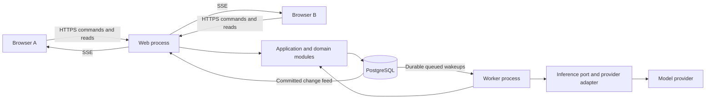
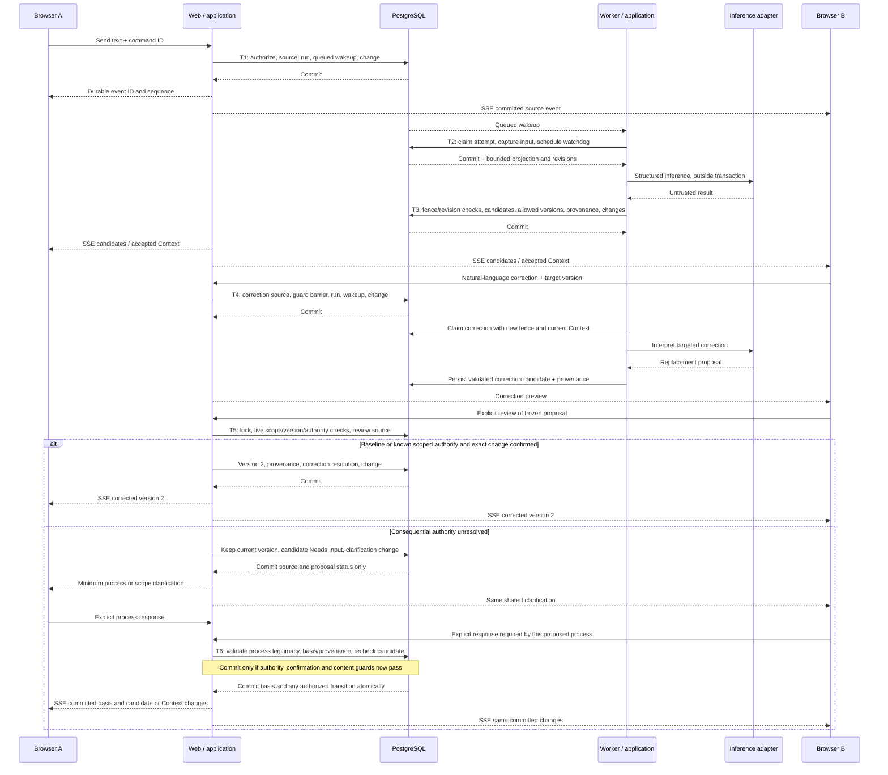

# Allinagent Architecture Proposal v0.2

**REFINED — 2026-09-10:** [ADR-0014 v2](../decisions/ADR-0014-active-work-specialist-contribution.md) approves Active Work / Specialist contribution semantics referenced in §§7, 10, 12 and 19: Work Contracts, shared operational control, continuity and governed outputs. Historical inference leases, coarse invalidation and actor-registry suggestions do not define that product model or mandate a generic framework. This remains an architecture proposal; [the implementation gate](../development/ACTIVE_WORK_GATE.md) proposes a bounded first increment, with no BUILD authorization.

**REFINED — 2026-09-10:** [ADR-0012](../decisions/ADR-0012-workspace-email-privacy-bozze-invio.md) governs Workspace Email: private observations, explicit disclosure, versioned internal drafts, exact self-authorized effects and uncertain-outcome reconciliation. Any illustrative generic send/draft integration wording is subordinate to this model. See [Email BUILD](../development/EMAIL.md); no provider or unrelated proposal is approved by this refinement.

**REFINED — 2026-09-10:** [ADR-0011](../decisions/ADR-0011-calendar-stato-temporale-osservazioni-azioni.md) defines Calendar temporal state, private observations, exact external actions, identity links and uncertain-outcome recovery. Illustrative integration/schema passages must follow those distinctions; they do not authorize mirroring or automatic canonical changes. Implemented boundaries are in [Calendar BUILD](../development/CALENDAR.md). This document remains a proposal.

**REFINED — 2026-09-10:** [ADR-0010](../decisions/ADR-0010-client-nativi-backend-comune.md) approva client SwiftUI/Compose, Next.js come client web e backend TypeScript/Node/PostgreSQL comune. §§3–4 e 17–18 non rendono Next.js il confine dell’applicazione. Il resto del documento rimane una proposta.


## Allineamento documentale ad ADR-0009 e chiusura di B2

**Data: 2026-09-09 (Europe/Rome). Stato: APPROVED DECISION per la visibilità storica e APPROVED MVP PRODUCT POLICY per le regole operative; B2 sufficientemente risolta per la pianificazione implementativa.**

[ADR-0009](../decisions/ADR-0009-visibilita-storica-membri-confine-condiviso-workspace.md) stabilisce la visibilità della storia condivisa conservata come conseguenza esplicita dell’ammissione umana, senza cutoff individuali. La [policy B2 canonica, MVP §14.1](../product/MVP_SPEC_v0.1.md#141-policy-operativa-b2-approvata), contiene gli otto punti approvati su partecipazione, inviti, rimozioni, rientro, atti pendenti e delega limitata agli inviti. **REFINED — §§7, 9, 11 e 13:** le implementazioni seguono questi confini e ADR-0006–ADR-0008; il precedente schema owner/member rimane illustrativo e incompleto. Le note sottostanti che indicano B2 aperta sono storiche. La v0.2 resta una proposta per le scelte non approvate; questa chiusura non ratifica schema, stack o implementazione. ADR-0001–ADR-0008 e v0.1 restano invariati.

## Allineamento documentale alla governance protetta ADR-0008

**Data: 2026-09-09 (Europe/Rome). Stato: APPROVED DECISION soltanto per la governance protetta qui richiamata; restante B2 e architettura non ratificate.**

[ADR-0008](../decisions/ADR-0008-governance-accesso-protetta-condizioni-congiunte-rinuncia.md) precisa protezioni, condizioni congiunte, rinuncia personale e delega operativa. **REFINED — §§7, 13 e 20:** membership e capability non possono aggirare protezioni; la fine di una partecipazione può rendere non esercitabile una condizione congiunta senza ridurla ai rimasti o conservare authority all’ex titolare. Le note storiche restano delimitate dai rispettivi atti. ADR-0001–ADR-0007 e v0.1 rimangono invariati; schema, restante B2 e implementazione non sono approvati.

## Allineamento documentale al bootstrap ADR-0007

**Data: 2026-09-09 (Europe/Rome). Stato: APPROVED DECISION soltanto per la fondazione del bootstrap B2; la restante B2 e questa architettura rimangono proposte.**

[ADR-0007](../decisions/ADR-0007-bootstrap-accesso-uscita-volontaria-continuita-workspace.md) precisa il bootstrap lasciato aperto da ADR-0006: relazione iniziale ordinaria, nessun override del creator, uscita/rinuncia senza obbligo di successione e continuità delle attività permesse anche senza governance esercitabile. **REFINED — §§7, 9, 13 e 20:** owner membership, successione pendente, accesso e lifecycle vanno letti entro questi confini; chiusura/archiviazione/cancellazione richiedono authority separata e policy ancora irrisolta. Le note storiche sottostanti non approvano la restante B2. ADR-0001–ADR-0006 e v0.1 restano invariati; nessuno schema, bootstrap implementativo o altra implementazione è autorizzato.

## Allineamento documentale alla fondazione di accesso ADR-0006

**Data: 2026-09-09 (Europe/Rome). Stato: APPROVED DECISION soltanto per la fondazione delle relazioni di accesso; B2 e la restante proposta non sono ratificati da questo atto.**

[ADR-0006](../decisions/ADR-0006-accesso-workspace-capability-relazioni-authority.md) distingue capability operative, authority per modificarne le relazioni, protezioni/condizioni applicabili e idoneità dell’account, preservando la separazione dal progetto. **REFINED:** `owner/member` (§7) e access ownership/bootstrap (§§9, 13 e 20) non definiscono un ruolo universale completo né un privilegio permanente del creator. Lo stesso Workspace deve poter sostenere relazioni differenti ed evolutive senza semantica derivata dal tipo sociale del gruppo. Regole B2, schema e implementazione restano da definire; nessun motore generico è approvato. Le note storiche sottostanti, incluse le diciture dei §§21–22, conservano il proprio perimetro originario e non approvano l’intera architettura. ADR-0001–ADR-0005 rimangono invariati.

## Allineamento documentale alla decisione B1 approvata

**Data: 2026-09-09 (Europe/Rome). Stato: APPROVED DECISION limitatamente al modello autorevole di persistenza; la restante proposta resta in review.**

[ADR-0005](../decisions/ADR-0005-postgresql-stato-canonico-storia-provenance.md) registra l’approvazione esplicita di B1: PostgreSQL come system of record, stato corrente direttamente interrogabile, storia/provenance preservate e comandi validati con atomicità di dominio; full event sourcing escluso come fondazione dell’MVP. Il precedente stato proposto di **F01 è superato soltanto per questo modello**, non per l’esatta rappresentazione tecnica. Schema del §7, current pointers, layout/numero di tabelle, uso generalizzato di `context_item`, gate e meccanismi transazionali illustrativi restano non ratificati. Le note e formulazioni storiche sottostanti descrivono le rispettive fasi precedenti, non l’approvazione attuale. ADR-0001–0004 restano invariati; nessun’altra decisione, bootstrap o implementazione è autorizzato.

## Allineamento documentale alla Decisione 3 approvata

**Data: 2026-09-09 (Europe/Rome). Stato: recepimento di una APPROVED DECISION di prodotto; la proposta architetturale resta in review.**

Il testo completo del lifecycle approvato è in [ADR-0003](../decisions/ADR-0003-lifecycle-goal-continuita-relazioni.md), 12 punti con il solo punto 2 sostitutivo. **SUPERSEDED:** l’unicità di un elemento/identità Goal per Workspace del §7, richiamata nei §§19 e 21/C05, come limite del modello di prodotto; l’unicità riguarda il Goal principale corrente, preservando identità storiche e Sub-goal. **REFINED:** versioni, relazioni e percorso di cambiamento dei §§6–7, 9–10 e 15–16 devono rispettare la classificazione autorizzata, le adesioni e l’authority specifica sugli effetti collegati. Una semplice parafrasi non richiede una procedura di authority.

La [tabella di supersessioni/refinement](../decisions/ADR-0003-lifecycle-goal-continuita-relazioni.md#supersessioni-e-raffinamenti-espliciti) delimita questi effetti. ADR-0001 e ADR-0002, le rispettive note sottostanti e il corpo precedente della proposta sono conservati invariati; le precedenti esclusioni del lifecycle indicano il perimetro di quelle registrazioni storiche. Schema, migrazioni, gate, algoritmi, fixture, stack e soluzione tecnica C05 non sono approvati o implementati da questo atto.

## Allineamento documentale alla Decisione 2 approvata

**Data: 2026-09-09 (Europe/Rome). Stato: recepimento di una APPROVED DECISION di prodotto; la proposta architetturale resta in review.**

La [Decisione 2 / ADR-0002](../decisions/ADR-0002-affermazioni-attribuite-informazioni-accettate-impegni.md) contiene il testo completo approvato in 12 punti, con il solo punto 4 sostitutivo. Distingue affermazioni attribuite, Accepted Information e impegni efficaci. L’accettazione editoriale è una capability di base del prodotto per i membri abilitati a contribuire, non decision authority o un mandato ADR-0001; non modifica automaticamente stato normativo o autorizzazioni operative.

**Passaggi superseded/refined:** §§6–7 e 21/F02 (terminologia “Fact/canonical truth” e base dell’accettazione), §9 (baseline e confine tra conferma editoriale e authority), §§9–10, 12 e 15 (correzioni, proiezioni ed esempio di attribuzione chiamata “Fact”). Effetti e limiti precisi sono nella [tabella di supersessioni di ADR-0002](../decisions/ADR-0002-affermazioni-attribuite-informazioni-accettate-impegni.md#supersessioni-e-raffinamenti-espliciti). Nei passaggi incompatibili prevale il testo approvato: né confidence né semplice dichiarazione rendono accettata un’informazione sostanziale; un’accettazione editoriale non richiede un mandato e non elimina dissenso o storia.

**Perimetro:** ADR-0001 rimane invariato. Schema, tipi tecnici, quattro gate, algoritmi, stack e fixture non sono approvati da questo atto; il loro allineamento tecnico resta da progettare. La nota del 2026-09-08 sulla Decisione 1 e il corpo originario della proposta sono conservati integralmente sotto: «Decisione 2 non affrontata» descrive il perimetro di quella nota storica, non lo stato corrente. Nessuna implementazione è avviata.

## Allineamento documentale alla Decisione 1 approvata

**Data: 2026-09-08 (Europe/Rome). Stato di questa nota: recepimento di una APPROVED DECISION di prodotto. La proposta architetturale resta in review.**

L’utente ha approvato formalmente la sola [Decisione 1 — Prima authority, Goal iniziale e setup progressivo (ADR-0001)](../decisions/ADR-0001-prima-authority-goal-iniziale-setup-progressivo.md), inclusa la correzione del punto 2 che riferisce l’adesione a una specifica identità/versione del Goal e al contenuto accettato, senza richiedere identità letterale della formulazione.

La [specifica canonica](../product/MVP_SPEC_v0.1.md) incorpora la decisione nei §§2.1, 9 e 17. L’ADR conserva i 12 punti esatti, l’atto di approvazione, la data, la motivazione e le supersessioni. Questa nota li applica al perimetro del documento senza riscrivere né approvare le altre scelte tecniche.

### Passaggi della proposta superseduti o raffinati

| Sezioni del testo precedente conservato sotto | Allineamento vincolante alla Decisione 1 |
| --- | --- |
| §§7, 9 e 15: Goal iniziale mantenuto soltanto come proposta in attesa di authority precedente | Una persona può stabilire il Goal iniziale come espressione esplicita del proprio intento senza delega precedente. La condivisione richiede adesioni esplicite a identità/versione e contenuto. Il divieto di poteri collettivi derivati soltanto da creator/owner/membership resta valido. |
| §§9, 16 e 19: chiarimenti descritti come possibili soltanto al tentativo di commitment | È ammessa anche la facilitazione facoltativa alla creazione, all’ingresso di membri, ai cambiamenti significativi del gruppo e durante il lavoro. I chiarimenti necessari al Commit Point restano distinti dal setup facoltativo; non si ristabilisce un mandato già valido. |
| §§7, 9, 13 e 21/F06: prima authority e rappresentazione dei mandati | L’origine esplicita dei mandati è ora stabilita dai punti 1 e 6 dell’ADR; adesione, partecipazione e authority restano indipendenti. Vanno rispettati contenuto verificabile, accettazione del mandato, approvazioni congiunte nominative, modifiche attribuite/versionate e sospensione dei nuovi usi per la persona che contesta la propria rappresentanza. |
| §§9, 13 e 20: ingresso, uscita e cambiamenti del gruppo | Nessun consenso o potere deriva dal cambiamento di membership. Non si estendono deleghe, trasferiscono poteri o riducono automaticamente i consensi richiesti; si chiariscono gli accordi interessati entro il perimetro approvato. |
| §16: scenari di verifica del Goal iniziale e delle domande sull’authority | La futura verifica dovrà distinguere l’intento personale esplicito da un mandato collettivo e il setup facoltativo dal chiarimento necessario per committare. Le aspettative precedenti incompatibili con tale distinzione sono superate; nessun test applicativo è stato eseguito o implementato. |

**Perimetro della supersessione:** nei soli punti sopra identificati, il testo esatto approvato in ADR-0001 prevale sulle formulazioni precedenti. Il corpo della v0.2 sotto questa nota è conservato integralmente per tracciabilità. Le diciture storiche «architecture direction broadly approved» e i riferimenti a una direzione già approvata non costituiscono prova di approvazione delle altre decisioni e non sono ratificati dall’approvazione della Decisione 1.

**Allineamento tecnico ancora da progettare, non approvato qui:** la rappresentazione di adesioni a identità/versione, mandati individuali e approvazioni congiunte, modifiche e contestazioni deve essere riesaminata rispetto allo schema e ai contratti illustrativi della v0.2. Questa registrazione non sceglie tabelle, campi, gate, algoritmi o dettagli UX. Le quattro regole di accettazione proposte, C05 sul modello persistente del Goal, lo stack e tutte le altre scelte tecniche mantengono il loro stato di proposta. Non si affrontano Fact vs commitment, lifecycle del Goal o Decisione 2.

## Testo della proposta precedente conservato

Status: targeted revision for review; architecture direction broadly approved. Application implementation is outside this task. Date: 8 September 2026.

Product authority: [MVP_SPEC_v0.1.md](../product/MVP_SPEC_v0.1.md). Engineering constraints: [AGENTS.md](../../AGENTS.md). Both were read completely, together with [the preserved v0.1 proposal](ARCHITECTURE_PROPOSAL_v0.1.md). The repository remains documentation-only, with no application or package configuration.

This document preserves the approved architectural direction and applies the product review's authority correction. It does not amend the product specification. Slice 01 mechanisms and operating limits remain implementation recommendations. All implementation trees, contracts and commands are illustrative future work.

## Changes from v0.1

- Replace the provisional unanimity rule with Progressive & Scoped Authority: check Actor × Scope × Capability × Consequence at the Commit Point, reuse explicit valid authority, and resolve only missing authority conversationally. Update F06, acceptance, persistence, concurrency, authorization, sequence, tests and failure cases; membership and access ownership never supply project authority.
- Keep short Workspace locks and coarse correction guards for Slice 01, while explicitly allowing future work to compute concurrently and submit guarded transitions. F04's consistency guarantees remain unchanged.
- Retain the recommended technologies; defer exact supported runtime, framework, database and package releases to bootstrap. No required feature ties this design to a named release number.
- Clarify SSE as committed-change delivery and Graphile as transactional wakeup infrastructure, both replaceable without changing Context semantics.
- Separate F01–F07 approval from bootstrap pins, and expand failure review with authority cases A–E. Correct the illustrative architecture filenames in §14. No other foundational decision or product scope changes.

## 1. Executive Summary

Build a TypeScript modular monolith using Node.js, React and Next.js, PostgreSQL, Drizzle with node-postgres, Zod, Better Auth, Graphile Worker and server-sent events (SSE). Use the AI SDK behind a small application-owned inference interface. Deploy one web process, one worker process and one managed PostgreSQL database on Render. Web and worker share the same codebase and domain modules.

PostgreSQL owns messages, accepted Context, candidates, provenance and versions. The worker performs asynchronous interpretation. Only application commands can accept a candidate or change canonical state. SSE delivers committed changes; it never owns workspace memory.

Vertical Slice 01 includes authenticated membership, an optional-at-creation but persistent Goal, one Conversation, incremental text processing, candidate review, accepted Context, provenance inspection and natural-language correction with preserved versions. Files, calendar, external actions and Specialist Actors remain subsequent slices within the full MVP scope.

For Slice 01, the critical design is a short transactional write boundary per Workspace, immutable source activity and Context versions, optimistic revision checks, and at most one current incremental Context inference attempt per Workspace. This coordination strategy does not serialize every future workspace activity. A model call never holds a database transaction open. A submitted correction command immediately invalidates older in-flight interpretations before its replacement is accepted.

The cost of this simplicity is bounded inference throughput within one Workspace, conservative revalidation of candidates, and approximately one-second realtime delivery under normal conditions. These are acceptable starting trade-offs for small collaborating groups; message persistence remains available while AI processing is delayed.

## 2. Architectural Principles

1. Preserve Conversation, derived interpretation, canonical Shared Context and history as distinct concepts. The product's distinctions in MVP §§2–6 determine storage semantics.
2. Store current canonical state directly. Retain append-only source activity and version history alongside it. Normal reads do not replay an event log.
3. Give one application command ownership of each transaction. Raw activity, scheduling and delivery records associated with a write commit together.
4. Treat model output as an untrusted proposal. Evidence, confidence and membership do not confer authority; acceptance is a separate domain decision.
5. Use explicit workspace identity everywhere: queries, foreign keys, jobs, context assembly, cache keys and delivery cursors.
6. In Slice 01, coordinate short canonical mutations and their source/scheduling metadata with a Workspace lock. Human collaboration and network calls do not wait for model latency. Future concurrent activities submit guarded state transitions; the coarse lock/guard strategy is not a universal execution model.
7. Make retries safe through durable identities and constraints. Assume at-least-once execution and delivery, never exactly-once model invocation.
8. Keep source history stable during corrections. Undo creates a new version; it does not erase an earlier decision or message.
9. Add concrete modules as slices need them. Do not introduce microservices, Kubernetes, Kafka, generic agent orchestration, vector storage, a knowledge graph, full event sourcing or ceremonial CQRS.
10. Security and recoverability begin in Slice 01. The later security-hardening phase in MVP §18 does not defer isolation, authorization or backups.

## 3. Recommended Stack

These technology choices are architectural recommendations. Validate and pin exact supported, mutually compatible major/minor/patch releases during implementation bootstrap, including host availability and library compatibility; commit the resulting lockfile and runtime/database configuration then. This proposal requires no feature specific to Node 24, PostgreSQL 18 or Next.js 16, and those earlier example numbers are not architectural constraints. Consult the [Node release schedule](https://nodejs.org/en/about/previous-releases), [Next.js support policy](https://nextjs.org/support-policy) and [Render PostgreSQL version documentation](https://render.com/docs/postgresql-upgrading) at bootstrap. This task installs nothing.

| Area / Choice | Requirement it solves | Why preferable here | Main trade-off | Reversibility |
| --- | --- | --- | --- | --- |
| Language/runtime: strict TypeScript on a supported Node.js LTS release | Shared contracts, worker I/O and maintainable agent-assisted changes | One language across browser, application and AI integration; established libraries | Runtime validation is still necessary; CPU-heavy work will need separate execution later | COSTLY TO CHANGE |
| Frontend: React with Next.js App Router, CSS Modules | Conversation, candidate review, provenance and correction UI | Mature component model and one deployable web application | Next.js caching and client/server boundaries require discipline | COSTLY TO CHANGE |
| Backend: Next.js Node-runtime Route Handlers calling framework-independent application services | Authenticated commands, reads and streaming | No separate HTTP backend framework or internal HTTP hop | Long-lived streams require a persistent host; handlers must stay thin | COSTLY TO CHANGE |
| Repository: one package with domain modules and two entry points; pnpm | Fast iteration for one developer and coding agents | Shared contracts and atomic cross-module changes without monorepo tooling | Module boundaries are enforced by imports and review, not separate packages | EASY TO CHANGE |
| Database: PostgreSQL | Relational ownership, history, transactions and concurrency | One durable system also supports the queue and change feed | PostgreSQL availability affects the entire product | FOUNDATIONAL |
| Query layer: Drizzle over node-postgres; reviewed SQL migrations | Typed queries with explicit transactions, composite keys and locks | Keeps SQL and locking visible; supports targeted SQL where needed | Some constraints, RLS and privileged functions require handwritten SQL | COSTLY TO CHANGE |
| Validation: Zod | HTTP contracts, environment configuration and model schemas | Shared runtime schemas with inferred TypeScript types | Structural validation cannot establish truth or permission | EASY TO CHANGE |
| Authentication: Better Auth with database sessions and email/password; Resend for production verification/reset mail | Two real users, revocable sessions and account recovery | Self-hosted identity/session lifecycle, no custom password implementation | Security updates and email configuration remain our responsibility | COSTLY TO CHANGE |
| Client data: TanStack Query plus a small ordered change-feed reducer | Server-state cache, optimistic messages and reconnect | Query invalidation/refetch fits authoritative server state | Must reject old versions and deduplicate optimistic acknowledgements | EASY TO CHANGE |
| Realtime: same-origin SSE, durable PostgreSQL change feed, HTTP writes | Updates to both browsers and recovery after disconnect | Required server-to-client direction fits SSE; no broker or socket service | Open connections and indexed polling consume web/DB capacity | EASY TO CHANGE |
| Background work: Graphile Worker using the same PostgreSQL database | Durable scheduling, delayed wakeups and infrastructure retries | Enqueue through SQL in the source transaction; no Redis | Queue and product share database capacity; application idempotency is still required | COSTLY TO CHANGE |
| AI integration: AI SDK Core behind an owned port; one direct Anthropic adapter initially | Structured extraction without provider concepts in the domain | Reuses provider protocol handling while keeping our task contract stable | SDK and model upgrades require contract/quality checks; no automatic cross-provider fallback | EASY TO CHANGE |
| Files later: private Amazon S3 bucket accessed through a small storage adapter | Durable uploads with application-controlled access | Standard object storage; metadata and permissions remain relational | Signed URL expiry, scanning and retention need an ingestion slice | EASY TO CHANGE for adapter; COSTLY TO CHANGE once substantial data exists |
| Tests: Vitest, React Testing Library and Playwright; real PostgreSQL integration databases | Rules, database races, contracts and two-browser behavior | Fast pure tests plus realistic transaction and isolation checks | Integration/E2E tests require PostgreSQL and a running worker | EASY TO CHANGE |
| Local development: Node/pnpm on host, one PostgreSQL container | Simple checkout-to-running workflow | Mirrors database behavior with no local broker or cloud emulators | Docker is needed for the documented database setup | EASY TO CHANGE |
| Deployment: Render web service + background worker + managed PostgreSQL, same region | Persistent SSE, durable worker and managed backups | Three managed components; one application release | Higher fixed baseline than a sleeping demo; vendor operational dependency | EASY TO CHANGE with a planned database migration |
| Observability: structured Pino logs, application metrics and Sentry errors; OpenTelemetry-compatible trace IDs | Trace a message through inference, commit and delivery | Useful diagnostics without hosting an observability cluster | Third-party telemetry must exclude private payloads | EASY TO CHANGE |

Drizzle supports explicit transactions; use its transaction client for every statement in a command, including queue scheduling. Better Auth supports database sessions and a Drizzle adapter; disable its session cookie cache initially so revocation is not delayed by cached identity. Keep its CSRF protections and explicit trusted origins enabled. [Drizzle transactions](https://orm.drizzle.team/docs/transactions), [Better Auth installation](https://better-auth.com/docs/installation), [session management](https://better-auth.com/docs/concepts/session-management), [security options](https://better-auth.com/docs/reference/options).

Select the lowest-cost model in the initial adapter that passes the versioned Italian extraction/correction fixtures. Model identifier, token limits and task profile are deployment configuration, recorded in inference diagnostics. Exact model selection is reversible and does not block the data model. The AI SDK supports schema-based output and provider registration; neither replaces application validation. [Structured output](https://ai-sdk.dev/docs/reference/ai-sdk-core/output), [provider management](https://ai-sdk.dev/docs/ai-sdk-core/provider-management).

## 4. System Architecture



The web process owns authentication, HTTP boundaries and delivery. The worker owns asynchronous execution. Both use the same application commands, validation rules and persistence adapters. They are two execution modes of one modular monolith, not independently owned services.

Use one primary database and three schema areas: authentication-owned tables, application tables, and Graphile's operational schema. Graphile is execution infrastructure: jobs are wakeups/retry mechanisms; `inference_run`, attempts and domain records remain application-owned. Transactional enqueue prevents source creation and scheduling from diverging. Normal application queries never read Graphile internals to determine whether Context is accepted. A later queue replacement migrates outstanding wakeups and operational procedures, while preserving application run identity, guarded transitions and Context semantics.

No worker calls the web API to update Context. It calls the shared application service directly. No browser accesses PostgreSQL or provider credentials. No web handler performs an AI call after returning an HTTP response as an informal substitute for a job.

## 5. Domain Boundaries

| Module | Owns now | Permitted dependencies / boundary |
| --- | --- | --- |
| Identity adapter | Library-managed accounts and sessions; `AuthenticatedUser` | Exposes identity, never project authority |
| Workspaces | Workspace lifecycle, members, invitations | Provides authorized workspace scopes; membership administration is distinct from Context authority |
| Conversation | Append-only source events and timeline queries | Creates processing requests for supported human events; does not interpret them |
| Context | Goal commands, candidates, acceptance rules, items, versions, correction and provenance | Owns all canonical Context mutations; does not import provider SDKs |
| Context processing | Incremental task scheduling, relevant-input assembly, inference attempts | Calls the inference port, then Context commands; cannot directly set accepted state |
| Collaboration policy | Small pure rule set inside Context initially | Classifies the four commit gates in §9; checks explicit scoped authority and exact-change confirmation at commit; records minimal conversational process resolution; no configurable permission engine |
| Delivery | Workspace changes and authorized SSE catch-up | Reads committed records; cannot mutate domain state |
| Infrastructure | PostgreSQL/Drizzle, Graphile, authentication, AI SDK and telemetry adapters | Implements narrowly defined ports; no generic repository or service-locator framework |

Use plain functions and explicit dependencies. Domain rules have no HTTP request, React, SDK response or database connection types. Application services coordinate repositories inside one transaction. Repositories own concrete queries; do not create one generic CRUD abstraction for every entity.

Boundary enforcement belongs in import restrictions and tests: browser code cannot import server modules; domain code cannot import infrastructure; modules expose intentional application functions. A worker must use `acceptCandidate` or `applyCorrection`, not duplicate their SQL.

## 6. Source / Derived / Canonical / History Model

| Category | Representation | Mutation rules |
| --- | --- | --- |
| Source activity | Human messages, correction requests, explicit review actions, relevant Miriam/system messages | Append-only records. Later interpretation never changes their body, author or ordering |
| Derived/inferred | Inference results, candidates, candidate status, relevance classification | May be rejected, invalidated or replaced. Candidate proposed content is immutable; a different proposal receives a new ID |
| Canonical | Context item identity and pointer to its accepted current version; Workspace membership/lifecycle and explicitly established authority bases | Changes only through validated commands under authority and concurrency checks |
| History | Immutable Context versions, provenance links, source review/correction events | New transitions append versions; old ones remain inspectable |
| Operational | Inference runs/attempts, queued jobs and realtime change feed | Supports execution and delivery. Does not determine product truth |

A Context item has stable identity. Its current pointer chooses an immutable version holding the accepted content and status. Thus the current value is not duplicated in an independently editable JSON snapshot. A version also represents the item's state transition: previous version, transition type, cause, rationale, actor and policy basis. A separate generic `StateTransition` table is unnecessary now.

Correction is an appended request followed by a proposed or authorized replacement version. Supersession within an item means advancing its current pointer; supersession by a different item can reference that replacement item. Retraction creates a new retracted version. Restore/undo creates another version with a link to the version being restored. None rewinds counters or deletes provenance.

Keep acceptance separate from alignment: an accepted Context item may truthfully record an unresolved Open Question or a contested Decision. `candidate.status = accepted` does not mean `decision.alignment = settled`.

Append-only applies to ordinary product operations. A future authorized retention/redaction process must explicitly account for raw text, versions, AI inputs and backups. Do not promise irrevocable retention of private content, and do not implement normal corrections as erasure.

## 7. Initial Relational Data Model

### Common conventions

Use UUID identifiers, UTC `timestamptz`, integer version numbers and `bigint` ordering/revision counters. Serialize bigint cursors as decimal strings in HTTP/JSON. Do not use client timestamps, UUID order or a global database sequence as workspace commit order.

Every workspace-owned row carries `workspace_id`. Every relationship between workspace-owned entities uses a composite foreign key including `workspace_id`, backed by the corresponding unique key. Do not rely on globally unique IDs alone for isolation. Use restricted deletion rules for source/provenance/history, not cascading deletion during normal edits.

Canonical state uses typed columns. JSONB is allowed for bounded, versioned inference input/output envelopes and diagnostic manifests, where the shape is an integration contract; it is not the store for membership, Goal, Context lifecycle or authority.

### Entities

| Entity / classification | Purpose, ownership and important fields | Relationships, constraints and indexes |
| --- | --- | --- |
| `auth_user`, library `session`, `account`, `verification` / identity | Better Auth owns credentials and sessions. User ID, display name, email/verification, timestamps; domain references user ID | Keep library-required constraints/migrations. Never expose tokens/password data to workspace queries or models. A duplicate domain User table is unnecessary |
| `workspace` / canonical + coordination metadata | Workspace owns `id`, `name`, `created_by`, `lifecycle`, `activity_seq`, `change_seq`, `state_revision`, `guard_revision`, `membership_revision`, `authority_revision` | Row is the Slice 01 short mutation lock. `state_revision` changes for canonical Context transitions; `guard_revision` also changes for correction barriers/membership changes. `authority_revision` changes for authority-basis establishment, supersession or revocation, independently of content staleness (§10). Counters are server-managed, nonnegative |
| `workspace_member` / canonical access | Workspace owns `workspace_id`, `user_id`, `access_role` (`owner`/`member`), `status`, joined/left times | Unique `(workspace_id,user_id)`; index `(user_id,status,workspace_id)`. Retain former membership for history. Owner manages access, not all project decisions. **REFINED — [ADR-0006](../decisions/ADR-0006-accesso-workspace-capability-relazioni-authority.md): historical role shorthand, not a complete approved access-relationship model; exact schema and B2 rules remain unresolved.** |
| `workspace_invite` / access operational | Scoped, expiring invitation: token hash, inviter, expiry, consumed/revoked timestamp, consuming user | Unique token hash; scoped inviter/member link. Single-use redemption under workspace lock. Token is not an ongoing workspace credential |
| `source_event` / source + historical user actions | Workspace owns `id`, `seq`, `kind`, `actor_kind`, optional `actor_user_id`, `body_text`, `created_at`, `command_id`, `command_hash`. Optional typed `reply_to_event_id`, `target_item_id`, `expected_item_version`, `target_candidate_id`, `review_action`, `resolves_event_id`, `caused_by_run_id`, `authority_basis_id` | Unique `(workspace_id,id)` and `(workspace_id,seq)`. Unique command identity per actor/workspace with a request hash; same key/different body is a conflict. Actor/kind checks. Scoped links to candidate/item/events. Index candidate reviews by `(workspace_id,target_candidate_id,actor_user_id,seq)` |
| `inference_run` / operational logical task | One extraction/correction task for a source event: `id`, `workspace_id`, `source_event_id`, `task_kind`, `task_version`, `status`, `attempt_no`, `retry_cycle`, `calls_in_cycle`, `lease_until`, `next_attempt_at`, `review_only`, `last_error_code`, created/finished timestamps | Unique `(workspace_id,source_event_id,task_kind,task_version)`. Partial unique index on `workspace_id` while `status='running'`. Status: queued, running, retry_wait, completed, failed. Index nonterminal runs by workspace/source event. Attempt number is a fencing token, not model confidence |
| `inference_attempt` / operational history | Run attempt: `run_id`, `attempt_no`, status, captured guard/state revisions, source cutoff, prompt/schema/task versions, configured model/provider, input hash, bounded input manifest/envelope, validated output envelope, timings, token usage, error category | Unique `(workspace_id,run_id,attempt_no)`; FK to run. Attempt identity/input stay immutable; only terminal outcome fields finalize. Payload access is restricted and retention-bounded |
| `context_candidate` / derived or explicitly proposed | Immutable proposed operation: `id`, `origin_event_id`, `origin_kind` (human/inference), optional `run_id` and `attempt_no`, `ordinal`, `kind`, `operation`, `target_item_id`, `expected_version`, `proposed_text`, `proposed_alignment`, `rationale`, optional `reported_confidence`, `inferred_guard_revision`, `review_membership_revision`, `status`, `commit_gate`, optional `assessed_authority_basis_id`, `assessed_authority_revision`, `accepted_version_id` | Unique `(workspace_id,run_id,attempt_no,ordinal)` for inference; unique `(workspace_id,origin_event_id,ordinal)` for human proposals. Scoped source/target/attempt links and an origin-shape check. Status: pending, needs_input, accepted, rejected, stale. A status update cannot alter proposal text or its content/provenance basis. Gate/authority assessment is derived and may be recomputed; it never authorizes a commit by itself |
| `context_authority_basis` / explicit process record | Context owns a narrow, evidence-backed basis for Slice 01 Context commits: `id`, `source_kind` (shared/resource/delegated), `actor_user_id`, `scope_kind` (candidate/item/bounded_topic), scoped candidate/item IDs where applicable, `scope_text`, `capability` (commit_context/establish_context_process), `consequence_limit`, `limits_text`, `process_text`, `establishing_event_id`, optional `established_under_basis_id`, `policy_version`, validity times and lifecycle (active/suspended/revoked/superseded) | Scoped FKs and checks bind the actor, scope, establishing event and any prior basis to this Workspace. Immutable semantic fields; changes create a new basis ID. Lifecycle changes require an appended source event and valid process authority. Index workspace/actor/scope/lifecycle. Authority provenance is mandatory. No automatic basis on joining or creation; no arbitrary role/grant matrix |
| `context_item` / canonical identity | Workspace-owned `id`, `kind`, `current_version_no`, created timestamp | Kinds initially `goal`, `decision`, `constraint`, `fact`, `open_question`. Unique `(workspace_id,id)` and `(workspace_id,id,kind)`. Partial uniqueness for one Goal item per workspace. Deferred composite FK to its current version; no committed item without a version |
| `context_version` / canonical value + immutable history | `item_id`, `version_no`, `kind`, `text`, `lifecycle`, `alignment`, `previous_version_no`, `transition_kind`, `cause_event_id`, optional candidate, `performed_by_kind/user`, `authority_source`, optional `authority_basis_id`, `policy_version`, `rationale`, `state_revision`, `created_at`, optional `superseded_by_item_id` / `restores_version_no` | PK `(workspace_id,item_id,version_no)`; scoped links to item/previous version/cause/candidate. Version 1 has no predecessor; subsequent versions reference N−1. Unique accepted candidate reference prevents double acceptance. Index `(workspace_id,state_revision)`. `authority_source` is shared/resource/delegated/system: non-system acceptance requires the scoped basis FK; system acceptance requires the named narrow baseline policy and its review evidence where applicable |
| `provenance_link` / source and history links | Workspace-owned link from exactly one candidate OR Context version OR authority basis to exactly one source event OR immutable Context version; `relation` (supports, corrects, contradicts, authorizes), optional exact source-text offsets | XOR checks for owner and source; scoped FKs; uniqueness of each owner/source/relation tuple; indexes in both directions. Accepted versions require a causal raw event and valid supporting/correction lineage. Offsets are validated against the immutable source body |
| `workspace_change` / durable delivery | Small committed envelope: `workspace_id`, `seq`, `kind`, optional `source_event_id`, `context_item_id` + version, `candidate_id`, `run_id`, `authority_basis_id`, current state revision, timestamp | PK `(workspace_id,seq)`; typed subject checks/FKs for each kind. Append in the transaction that changes its subject. It contains references, not a second copy of the entire workspace |

There are twelve application entities above plus authentication-owned tables and Graphile's own schema. The one addition to v0.1 is a narrow Context authority-basis record: it lets Slice 01 remember a conversational process and reuse an explicit branding mandate without deriving permission from membership or counting approvals. Source events retain the human acts; the basis records their applicable scope; accepted versions retain the basis used. The remaining entities keep their original responsibilities. This is not an Actor registry, permission administration UI, generic delegation graph or external-resource connector.

Use text fields with explicit checks for evolving domain enums rather than an opaque JSON payload. Migrations can widen supported kinds. Enforce mandatory version and authority-basis provenance with a deferred constraint check at transaction completion, plus application validation before inserts; candidate/version/provenance insertion order must remain possible within one transaction. Circular source-event/basis references use deferred scoped foreign keys so their atomic creation never requires rewriting immutable source records.

An explicit human Goal/edit proposal does not require a fabricated AI run. Its candidate references the original command event; inference-generated candidates additionally require a real attempt. Source command uniqueness includes actor kind and treats a null system/Miriam user ID as a comparable value, so system retries cannot bypass deduplication through SQL null semantics.

Provenance targets only source events and already-existing immutable Context versions, never mutable current pointers or the newly created version itself. Validate supporting references against the captured input and keep the previous version's original support alongside the new correction/authorization links. A correction's rationale is an inspectable explanation, not stored hidden model reasoning. Authority bases link to the authenticated acts establishing the process, any existing mandate permitting establishment, and relevant immutable constraints limiting its consequences. The fixed System Authority baseline is versioned application policy, not an editable human grant. A model-generated description or provenance link alone cannot establish legitimate authority; §9 defines the validation boundary.

`ContextVersion` serves as the first Decision transition record: outcome is its text, alignment is typed, and rationale/provenance/previous state are preserved. Slice 01 does not claim to compute the complete Decision consequence graph. Future structured consequences can reference these immutable version IDs.

### Concepts without a separate table yet

- **Goal:** a Context item with dedicated Goal commands, a unique-per-workspace identity and version history. Its required semantics are not implemented as arbitrary Notes. Absence of an initial Goal is allowed; genuinely Goal-dependent inference waits or asks for one. A proposed initial Goal remains a persistent candidate with provenance and an explicit proposed label; it may orient preparation without being treated as a committed group mandate.
- **Conversation:** one primary timeline is scoped directly to the Workspace. Semantic Workstreams later link existing events; they do not require creating conversations or relocating messages.
- **Shared Context:** the set of accepted current Context versions, not a singleton JSON document.
- **StateTransition:** represented by typed immutable Context versions for this slice.
- **Candidate reviews:** explicit immutable `source_event` records, queried per candidate and actor. Determine the latest approve/reject/withdraw response by sequence. Reviews confirm the exact proposed change; they are not a vote tally and do not create authority. A response by a person without applicable authority may record an opinion without accepting, rejecting on behalf of the group or vetoing canonical state.
- **Current State, Catch-up, Evidence objects, Tasks, Artifacts, Workstreams, Sub-goals, Actor registry and Active Work:** no tables until their own slice needs them. Operational inference runs are not the future product Active Work model.
- **Vector embeddings, knowledge graph and generalized workflow definitions:** absent.

## 8. Event Model

Use `source_event` for what happened, `workspace_change` for what clients need to fetch, and `inference_run` for work to do. They have different retention, security and idempotency semantics.

| Event kind | Meaning | Processing behavior |
| --- | --- | --- |
| `human_message` | Authenticated user's original text | Enqueue bounded relevance/extraction work |
| `correction_requested` | Original natural-language correction; target/version if supplied | Establish correction barrier synchronously; enqueue correction interpretation |
| `candidate_reviewed` | Explicit review of an immutable proposal | Run deterministic acceptance logic; do not infer consent again from the review event |
| `authority_process_recorded` / `authority_basis_changed` | Explicit authenticated process resolution or authorized basis supersession/revocation, with original conversational text and proof | Validate the actor's authority to establish/change that process; persist basis, provenance, authority revision and delivery atomically. Unresolved discussion remains source/proposal; the model cannot emit an effective grant |
| `goal_requested` / `context_edit_requested` | Explicit structured command with original text | Create a proposal or execute an already-authorized exact edit through Context rules |
| `correction_resolved` | Accepted correction or explicit dismissal/clarification resolving a prior request | Close barrier; preserve the original request |
| `processing_retry_requested` | Explicit retry of a failed interpretation | Starts a new bounded retry cycle on the existing logical run; preserves all earlier attempts |
| `miriam_message` | Relevant conversational contribution or clarification | Persist if shown as conversation; do not automatically feed it back into extraction |
| `workspace_event` | Membership or meaningful system activity | Only specifically supported subtypes affect processing; no recursive generic trigger |

Message body is plain text in Slice 01; render it safely. Stable command fields are typed columns, not executable instructions. Future file events point to file records while keeping the original event ID stable.

The primary correction path opens from a Context item (or an explicit correction action in the composer) and sends natural-language text as `correction_requested`; this supplies synchronous intent and optional target metadata without requiring a rigid replacement form. An unmarked ordinary message may only be recognized as corrective asynchronously. In that case, retain the original `human_message`, record the detected interpretation as a proposal with source provenance, and establish a correction barrier when offering the correction for review. Do not retrospectively relabel raw history or claim the request-time barrier existed before intent was recognized. The user-visible correction guarantee starts at the explicit correction command/barrier, not at an unknowable semantic instant inside arbitrary chat.

Allocate `activity_seq` while holding the Workspace row lock. Allocate change-feed sequences from `workspace.change_seq` under the same lock. Multiple records in one transaction receive a contiguous block. A rolled-back transaction exposes none of them. This prevents an earlier allocated ID from committing after a client has advanced past it.

Client commands carry a random `command_id`. Store the normalized request hash. A duplicate command returns its durable event/result after checking current authorization. A reused key with different content returns `409 Conflict`. Source ID deduplication does not attempt to infer that two independently sent human messages mean the same thing.

## 9. Incremental Context Engine

### Processing one new event

1. **Receive and validate.** Authenticate, validate body/size with Zod, establish workspace scope and verify active membership. Author and sequence come from the server.
2. **Transaction T1: source and scheduling.** Lock Workspace; recheck membership and command identity. Insert source event, increment activity sequence, create the unique logical inference run and insert the conversation change. Enqueue a `process_workspace_context` wakeup through Graphile SQL in this same transaction. Commit before replying to the browser.
3. **Durable wakeup.** A job payload contains only the workspace ID and protocol version. The handler loads the actual work from scoped database rows. Wakeups can duplicate; they are not canonical processing state.
4. **Transaction T2: claim and capture.** Lock Workspace, find an eligible run, and claim it by incrementing `attempt_no`, setting `running` and a lease. Create its immutable attempt input record. An existing unexpired running attempt prevents another claim. Capture canonical state and `guard_revision` consistently in this short transaction. Commit.
5. **Asynchronous boundary.** Assemble the prompt from the captured bounded inputs and invoke the provider outside the database transaction. No database connection or lock remains reserved for model latency.
6. **Structural validation.** Accept only a complete schema-valid response. Refusals, truncated output, unknown fields, over-limit collections and malformed values are failures, not an empty successful result.
7. **Application validation.** Validate workspace-scoped references, input membership, exact source spans, target versions, permitted operations and coherence with task purpose. Classify consequences and confirmation needs on the server; compute the authority gate when an actual acceptance is attempted. Model claims about authority, consensus or risk cannot authorize a write.
8. **Transaction T3: proposals and optional state.** Lock Workspace, reload the run, and require matching running status, attempt token, unexpired lease and captured guard revision. Verify all target versions and insert candidates with provenance. Mere proposals remain pending without initiating an authority questionnaire. For an allowed automatic low-risk acceptance or an already explicit exact acceptance request, evaluate the four-case policy against live authority and applicable confirmation, independently of the model result. Append canonical versions/provenance, update current pointers and increment state/guard revisions only if the checks pass.
9. **Complete atomically.** In T3 also append candidate/Context delivery changes, mark the run completed and enqueue continuation for remaining runs. Commit. Only now is any Context update authoritative.
10. **Delivery.** SSE picks up the committed change feed. Both clients see a pending candidate, accepted change, correction preview or meaningful processing problem as appropriate. An automatic acceptance has visible micro-feedback and an undo action.

Graphile supports durable at-least-once jobs and transactional SQL enqueueing. Its job key is not an application idempotency guarantee. Use a narrow privileged enqueue wrapper for the fixed task name and scoped workspace ID, not a database-owner web connection. [Graphile reliability](https://worker.graphile.org/docs), [SQL enqueue API and privileges](https://worker.graphile.org/docs/sql-add-job).

### Minimum relevant Context

**REFINED — approved product/architecture principle, 2026-09-09:** [ADR-0004 — Minimum Sufficient Context](../decisions/ADR-0004-context-efficiency-minimum-sufficient-context.md) governs all AI work. The numerical examples below are illustrative, configurable heuristics subordinate to context sufficiency, not approved product limits or universal caps. The budget-only `Needs Input` condition below, also summarized in §20, does not override the ability to obtain additional relevant context when the initial selection is insufficient, ambiguous or materially risky, within applicable access and authority boundaries. The previous proposal text is retained below for provenance. This refinement approves no retrieval, caching, summarization, compression, model-routing or prompt-construction strategy, schema or budget value.

For Slice 01, assemble the triggering event, its directly referenced/replied-to source, the current Goal, the explicitly targeted item and its relevant versions, applicable pending correction, and a bounded selection of current Context plus neighboring conversation. Start with at most 12 preceding messages, 20 relevant Context versions and an 8,000-input-token budget. These are tunable limits, not promises of semantic completeness.

Prefer deterministic selection: explicit references first, Goal and Constraints next, then lexical relevance and recency using PostgreSQL queries. Preserve item kind, accepted/proposed/contested status, version and provenance in the projection. Never flatten everything into an unlabeled prose summary. Do not let arbitrary source text become a system instruction.

Record the exact selected IDs/versions and truncation decisions in the attempt manifest. Explicit correction targets cannot be silently truncated; if they exceed the budget or the referent is missing, return Needs Input. A relevant-input task can later replace selection heuristics without changing canonical storage.

Process only the new event as the extraction subject. Neighboring events provide interpretation context, not permission to re-extract the entire window on every message. Every new candidate needs support from the triggering event; prior sources may supplement it. When a Goal is absent or relevance is uncertain, preserve the raw event and avoid unsupported canonical updates. Cheap relevance classification may produce `off_goal` with no candidates; do not discard source activity.

### Structured inference contract

```text
ContextInferenceV1 {
  schemaVersion: 1
  relevance: "relevant" | "off_goal" | "unclear"
  clarification: string | null
  candidates: [max 8] {
    kind: "decision" | "constraint" | "fact" | "open_question"
    operation: "create" | "correct" | "supersede" | "retract"
    targetItemId: UUID | null
    expectedVersion: positive integer | null
    proposedText: nonempty bounded string
    proposedAlignment: "proposed" | "settled" | "contested" | "unclear"
    rationale: bounded string
    reportedConfidence: number in [0, 1]
    supportingSources: [1..8] { eventId, startOffset, endOffset }
    referencedContextVersions: [0..8] { itemId, versionNo }
  }
}
```

The model cannot return `workspaceId`, `accepted`, a user/agent authority grant, SQL, an executable action or a provider-dependent domain type. Server code attaches identities. Goal changes use a dedicated command/confirmation path; extraction may suggest clarification rather than mutate the Goal.

### Acceptance and confirmation boundary

**Membership is not authority. Check authority at the Commit Point. Ask only when authority is unresolved.** This applies to canonical commitment, including an initial consequential Goal, and to the future external-action boundary. Creator, access owner, active member, confident speaker and last speaker are not project-authority categories. Silence never supplies consent; a Workspace with one member does not grant that member consequential authority by default.

Before that boundary, Miriam can understand, propose, compare, prepare and surface consequences. An unresolved commitment leaves the current canonical state intact and the proposal available. Confirmation of an exact change and authority to make that change are separate checks: a confirmed proposal can still lack authority, and an established authority basis does not confirm an AI interpretation the actor has never seen.

#### Small Slice 01 policy representation

Use a versioned pure policy function inside Context, not a permission engine. Its assessment has one of four `commit_gate` values, with a reason and an optional authority-basis reference. It evaluates **Actor × Scope × Capability × Consequence**, current versions, correction barriers and the explicit request/review. Store the assessment for display; recompute it from trusted records at commit.

Creating a candidate is not a request to commit it. Before an actual acceptance command or an explicitly permitted automatic transition reaches the boundary, the candidate can remain pending with no authority assessment. `commit_gate` and its assessment references/revision are nullable until then. A consequential proposal alone must not trigger an authority-resolution question; understanding, comparison and preparation remain available without establishing a mandate first.

| Gate | Scope and acceptance rule |
| --- | --- |
| `automatic_low_risk` | Narrow System Authority baseline: record a verbatim explicit Open Question that creates no commitment or state replacement, after evidence, duplicate and correction-barrier checks. This records that someone asked, not that the group accepts the premises or priority |
| `confirmation_required` | Low-impact informational Fact/Open Question or informational correction outside the automatic allowlist. The baseline System policy permits an active member to confirm the exact interpretation, with attribution and source provenance. This capability does not authorize consequential decisions or commitments; uncertain consequences move to a consequential gate |
| `consequential_known` | A valid explicit basis covers the actor, exact target/scope, capability and consequences. Apply the Action Policy: use an already explicit authorized exact command/review, or request the missing exact-change confirmation from the appropriate actor. Do not ask the group to re-establish known authority or collect every member's vote |
| `consequential_unresolved` | No sufficient basis, disputed/missing legitimacy, expired/revoked scope, or unclear consequences. Keep the candidate `needs_input`, preserve canonical state and optionality, and ask only the missing scope/process question. Resume guarded acceptance once a legitimate basis and required exact-change confirmation exist |

The server conservatively treats Decision, Constraint, Goal changes and consequential/destructive transitions as consequential; wording a budget commitment as a Fact does not lower its gate. A confidence score or proposed `settled` alignment never authorizes anything. Destructive/high-impact changes retain explicit confirmation and versioned recovery. An already explicit authorized command can supply confirmation; a second ritual approval is unnecessary.

For automatic Open Questions, require a create operation, an exact complete question span in the triggering human message and no inferred replacement or commitment. The item records that the named member asked that question. It does not treat “Quando apriamo il locale già scelto?” as proof that a location has been chosen. Uncertain meaning stays proposed.

#### Explicit basis, scope and provenance

| Product authority source | Slice 01 interpretation |
| --- | --- |
| Shared Authority | An explicit group decision/process establishes who can make the particular commitment, under which limits. Record the actual process and authenticated acts; do not substitute a membership count or invented consensus |
| Resource Authority | Legitimate control of the specific resource may authorize operations on that resource within its consequences. Verified access administration covers invitations, not the project's budget. Resource ownership alone cannot bind other people. External-resource verification/actions arrive in their own slice; unsupported proof remains unresolved here |
| Delegated Authority | An explicit, legitimate delegation covers a named actor and bounded scope/capability/consequences. Record its establishing process and limits. Observed responsibility is not delegation, and branding authority does not include changing an agreed budget |
| System Authority | The fixed, versioned baseline permits bounded understanding/proposal and the low-risk Context rules above, and enforces platform limits. It cannot manufacture human authority or override consequential human decisions |

Use the small `context_authority_basis` record in §7 only when needed. It records the named actor, a particular candidate/item or explicitly bounded topic, the supported Context capability, consequences/limits, process and provenance. Two supported capabilities distinguish committing Context from establishing a Context authority process; neither implies the other. Protected Context versions document constraints such as an agreed budget. Record exact candidate/item coverage whenever possible. A topic label or actor's assertion that something is “branding” cannot alone prove that the change fits its scope.

The application checks scope, affected targets and limits against the actual proposed transition and current authoritative records. Model reasoning may surface possible consequences or suggest a process for review, but cannot mark a basis valid, classify itself as authorized or hide a material consequence. If scope or an indirect budget consequence cannot be established from explicit records, the result is unresolved; ask that narrow question rather than implementing a speculative semantic permission engine. Slice 01 does not promise complete automatic consequence detection.

Creating, changing, suspending or revoking a basis also requires appropriate process authority. No user can mint a usable mandate by selecting themselves, claiming to represent the group or managing access. A delegated basis cites the explicit legitimate process/mandate that established it; validate its limits without automatic transitive grant inheritance. A direct Shared process must be evidenced by the affected participants' actual expressed mandates, or by an already established process authorized to represent them. If who can establish that process is itself unclear, keep it unresolved. Neither the worker nor an owner may fill that gap.

#### Minimal conversational resolution

For two members considering a consequential Decision with no established process, preserve the proposal and ask, for example: “Per questa decisione, come volete decidere e con quali limiti?” The participants may explicitly establish a one-time process: A proposes that B select the branding within the existing budget; B explicitly accepts that scoped arrangement. In this two-person example the actual participants have expressed that arrangement. Record the exact authenticated acts, scope and limits; do not generalize the example into a rule requiring all active members to approve every decision, and do not treat unanswered participants as consenting.

A proposed process does not become valid merely because its proposer says “we agreed.” If it attempts to bind an unrepresented person or resource, clarify the missing mandate. Once the process is legitimately established, B's exact in-scope choice can commit without polling everyone again. The process can be limited to that candidate; no permanent RBAC setup, governance dashboard or onboarding questionnaire is required.

Record resolution source, normalized basis, provenance, authority revision and delivery change atomically. Re-evaluate the unchanged candidate in the same transaction where possible. If B already explicitly confirmed its exact content, do not repeat that confirmation solely because the missing authority basis has now been resolved. A change to the proposal or relevant canonical state still requires the appropriate refresh and review.

Each candidate freezes its content, target version and content/provenance basis. Reviews bind to that identity; rejection or withdrawal is explicit. A non-authoritative objection remains visible source/alignment information, not an automatic veto or permission to overwrite. At commit, check current membership for access and current authority for the proposed consequence separately. Removal does not transfer decision rights to the remaining members. No reviewer count, majority threshold, electorate or universal voting rule is stored.

An initial Goal may be supplied as a persistent, visible proposal with creation-event provenance while its consequential acceptance awaits an explicit legitimate process. Conversation and preparation remain usable. The creator's identity, a sole membership or a confident Goal statement is not its authority basis. Once authorized, dedicated Goal commands create version 1 and preserve the proposal's history.

### Ordering, leases, retries and failures

Graphile is operational execution infrastructure; application-owned run/attempt records and a small claim rule protect sequential incremental understanding within a Workspace in Slice 01. Jobs only wake this rule or retry it. Replacing Graphile later must preserve transactional source/scheduling consistency and these application checks, without changing Context semantics. Do not depend on job arrival order or a process-local mutex. Under the Workspace row lock, claim the oldest nonterminal correction run first, then the oldest ordinary run by source sequence. A retry-waiting earliest run waits until its due time; later ordinary runs do not bypass it. Pending human review does not keep an inference run running.

At claim time, first inspect any running run. If its lease is live, make no new claim. If expired, finalize its old attempt as abandoned and return that run to queued before selecting the next run; this releases the partial unique constraint. Only then select, increment the chosen run's fence and claim it. Old callbacks may record their own late diagnostic outcome but must not clear a newer lease, change a newer attempt or enqueue another retry for it.

Start with a 45-second provider timeout and 90-second attempt lease. T2 schedules a watchdog wakeup at lease expiry in the same transaction as the claim. If a worker disappears, a later handler can reclaim the expired run with a higher attempt token. A delayed result from the old attempt cannot commit. Use two global concurrent model calls initially; different Workspaces can progress independently.

Known provider failures are recorded and retried with bounded application-level attempts: three calls per retry cycle with delays of 5 and 30 seconds plus jitter, honoring a longer provider `Retry-After`. Reserve the call budget in T2 before network I/O; timeouts, abandoned calls and stale results count toward it as well. Disable hidden SDK retries or include them in that budget. A schema failure permits one fresh schema-constrained retry within the same budget; do not repair arbitrary text into accepted state. A non-retryable credentials/configuration error fails fast and alerts the operator.

Known failures update the run and enqueue its delayed wakeup transactionally; acknowledge the current wakeup. Graphile's retries handle unhandled crashes/DB errors, not a second invisible provider-retry loop. Run/attempt records cap calls even after repeated wakeups. At exhaustion, mark failed, retain source and any previous canonical state, emit a concise retryable processing-status change and let later runs proceed. A terminal failure is not recorded as `off_goal` or as successful understanding.

An explicit retry records its source command, reopens the same logical run with a new retry cycle and `review_only=true`, and resets only that cycle's call budget. The monotonically increasing attempt fence is never reset. It does not erase failed attempts or automatically promote interpretations from old source into newer truth. Repeated guard invalidation can exhaust a cycle with a distinct `repeatedly_invalidated` status reason rather than silently calling forever. Periodic reconciliation in the existing worker re-enqueues due nonterminal runs whose wakeups were lost/exhausted. Queue-level metadata may be cleaned independently of durable run results.

Observability records correlation ID, workspace/run/attempt identifiers, queue delay, selected-input counts, latency, token usage, validation failures, retries, stale discards, lease recovery and committed version IDs. Do not log prompt bodies or raw model text to general logs. Restricted attempt payloads are for reproducibility, with an explicit retention limit; canonical provenance outlives them.

## 10. Concurrency & Consistency

Use PostgreSQL `READ COMMITTED` for Slice 01 commands, acquiring the Workspace row lock first for short canonical coordination mutations and their source, run, authority and feed metadata. This is a Slice-01 consistency strategy, not the universal concurrency model for every future workspace operation. Lock dependent item/run/basis rows in a consistent order afterward. Re-read membership, expected versions and current authority after acquiring the lock; never authorize from a pre-lock read. Pure snapshot/catch-up reads use a short repeatable-read transaction when a consistent cursor and state must be returned together. [PostgreSQL row locks](https://www.postgresql.org/docs/current/explicit-locking.html).

Model calls never hold the Workspace lock or a database transaction. Humans can persist conversation while inference is running. Future Active Work, research, Specialist Actors and Artifact processing may compute concurrently and submit short guarded state transitions. They must not inherit a workspace-long critical section or the single incremental-inference lease. Keep the coarse strategy for this slice; introduce more granular dependency/version fences only when measured false invalidations or coordination contention justify them, preserving the canonical model.

| Case | Expected behavior | Consistency mechanism |
| --- | --- | --- |
| A. Two humans send nearly simultaneously | Both messages persist; each receives a definitive per-workspace sequence. Neither replaces the other | Short Workspace row lock, monotonic transactional sequence, unique command identity |
| B. Two Context Engine jobs overlap | Only one current attempt is claimed per Workspace. A second wakeup returns or schedules a later wake; an expired older attempt can still compute but cannot commit | Partial unique running-run constraint, lease, monotonically increasing attempt fence and final transaction checks |
| C. Correction arrives during older inference | Correction request persists immediately and establishes a barrier. Older output cannot silently overwrite it, even before a corrected version exists | Synchronous guard increment; older unfinished runs become review-only; old pending candidates become stale; final guard comparison; correction-priority processing |
| D. Commit succeeds but acknowledgement fails | Retry finds the completed run/accepted candidate and returns the durable result. No duplicate version or micro-feedback event | Transactional run completion, unique candidate/acceptance constraints and command idempotency |
| E. Client writes from stale state | Return `409` with current authorized version; retain the user's draft and ask them to review/reapply | Expected item version and candidate revision; no last-write-wins overwrite |
| F. Authority changes while a proposal is being reviewed | Recheck the live basis, scope, limits, expiry, revocation and actor access inside the commit transaction; do not reuse a saved authority verdict | Basis mutations share the short lock and advance authority revision. Content reviews are not votes and cannot be made sufficient by removing members |

`state_revision` orders canonical Context transactions. `guard_revision` invalidates interpretation and content review when canonical state, pending corrections, membership or interpretation-affecting policy changes. Ordinary messages only advance activity/change counters; they do not continuously invalidate a running model call. Sequential processing supplies ordinary conversational continuity.

`authority_revision` invalidates cached authority assessments when a basis/process is established, changed or revoked. Such a change alone does not rewrite a candidate or make its unchanged content stale: commit always reloads the live basis and recomputes the gate. This avoids forcing another model call or repeating an exact-content confirmation merely to use a newly resolved process. If resolution also changes the Goal, budget, scope of the proposed operation or other interpretation inputs, normal content guards apply. Membership changes remain conservatively content-invalidating and always require live access/authority checks; no residual vote threshold or automatic transfer of rights is inferred.

### Correction barrier details

In the correction request transaction, increment the guard and set `review_only` on older unfinished runs. Mark older pending candidates stale. The pending correction is represented by its immutable source request without a corresponding explicit resolution event. While any such request is unresolved, disable automatic Context acceptance in that Workspace; this broad barrier is conservative and can later become target-scoped.

An in-flight result with a mismatched guard is retained as a stale diagnostic attempt, creates no accepted change and is scheduled for fresh interpretation within its remaining budget. The next claim prioritizes the correction. An ambiguous target produces Needs Input; it does not guess or clear the barrier. Its inference run completes while the correction request remains unresolved, so unrelated ordinary interpretation may continue with automation disabled. An authorized confirmed correction or an explicit valid dismissal appends `correction_resolved` and advances the guard again. A requester may withdraw their own request; that does not resolve someone else's request, establish agreement or authorize a consequential change. Other resolutions must satisfy the applicable scoped process. Older runs remain review-only after the barrier closes.

Failure handling, stale-result handling and lease recovery use the same guarded transaction discipline as success: a callback changes run state only if its attempt is still current. A missing correction target cannot disappear merely because its provider call failed; the original request stays open until a human resolves or dismisses it.

Candidate acceptance also rechecks its content guard, expected target version, review-only status and membership revision, then independently checks current authority and the exact-change confirmation under §9. A content-stale candidate cannot be approved by simply updating its saved revision: fresh interpretation or a fresh exact human proposal creates a new candidate and invalidates old content reviews. Initially, even unrelated canonical changes may force this conservative refresh. If an automatic acceptance in a batch advances the guard, remaining unaccepted candidates in that batch may require refresh as well; do not silently rebase their meaning.

For duplicate-looking creations from different messages, show the existing item to the inference task and reject exact normalized duplicates deterministically. Semantic equivalence is not a database uniqueness fact: ambiguous duplicates remain proposed for review, not silently merged.

A transition may affect several Context items later. Their versions share one state revision and commit atomically. SQLite-style test substitutes, timestamps as locks and queue-provider claims of exactly-once processing are insufficient for these guarantees.

## 11. Realtime Model

| Layer | Responsibility |
| --- | --- |
| PostgreSQL domain tables | Durable original events and accepted/pending state |
| `workspace_change` | Ordered replayable references to committed changes |
| SSE over authenticated HTTPS | At-least-once transport of those changes |
| TanStack Query and local UI | Disposable cache, pending drafts and optimistic presentation |

Slice 01 primarily needs server-to-client realtime delivery: writes use normal authenticated HTTP commands, and SSE transports only committed changes. PostgreSQL/domain records and the durable change feed remain authoritative; reconnect uses cursor replay. The transport is replaceable without changing domain or acceptance semantics.

Expose a same-origin workspace stream and a paginated changes endpoint using the same feed. Use HTTP commands for writes. Poll indexed `workspace_change` rows approximately once per second while a stream is active; use short queries, never a database transaction held for the lifetime of an SSE connection. Send heartbeat comments about every 15 seconds and close idle/slow streams with bounded output buffers.

SSE supplies event IDs and automatic reconnect behavior. Application code still owns durable recovery. Persistent Next.js hosting supports streaming, but reverse-proxy buffering must be disabled and verified on the deployed path. [SSE behavior](https://developer.mozilla.org/en-US/docs/Web/API/Server-sent_events/Using_server-sent_events), [Next.js self-hosted streaming](https://nextjs.org/docs/app/guides/self-hosting).

### Recovery protocol

1. Fetch an authorized bootstrap snapshot containing the recent Conversation page, current Context/candidates and a change cursor from the same repeatable-read snapshot.
2. Open SSE with that cursor. Select `seq > cursor ORDER BY seq`, with a bounded batch size. Never jump the cursor directly to the database's maximum without reading intervening records.
3. Process changes in order. Source events deduplicate by ID/sequence and reconcile optimistic messages by command ID. Context reads apply only equal/newer versions; late responses cannot regress the cache.
4. Advance the application cursor only after processing the batch. Use a reconnect wrapper with the last successfully applied cursor; native EventSource's last received ID alone is not proof that the application applied the change.
5. On transient failure, reconnect and replay; duplicates are harmless. On reload or workspace switch, fetch a fresh consistent bootstrap. Keep separate cache keys and cursors per Workspace and clear them on logout.
6. If the cursor is outside retention or ahead of the restored database, send `reset_required` and bootstrap again. A pruned feed does not imply deleted messages or Context history.

Candidate/run query responses also carry an `asOfChangeSeq` from their read snapshot. Keep a per-resource cache watermark, advanced when a change for that resource is observed, and reject older responses. Otherwise an old HTTP response could turn an accepted candidate back into pending even though Context item version checks are correct. A resource watermark must never advance the global applied-feed cursor: other resources may still have unapplied changes.

Retain the change feed for an initial 30-day recovery window, adjustable with measured growth. Catch-up later uses Context history, not this expiring transport log. At each outgoing data batch, validate the session and current membership against the database; revoked/expired access closes the stream. Authorization is judged at the batch read boundary; already delivered data cannot be recalled.

Return workspace snapshots, changes and streams with private, no-store cache policy. Do not put personalized workspace reads in Next.js shared caches or CDN caches. Authorization in a page component is not a substitute for checking the underlying Route Handler and subsequent stream batches.

Poll cost grows with connected clients. Measure it first. A later shared per-workspace poller or PostgreSQL notification can wake the same replay query without changing its durable cursor contract. Notifications would remain hints, not delivery guarantees. No CRDT is needed for append-only messages and versioned Context edits; collaborative Artifact editing is a later design. Reconsider WebSocket or another transport when actual bidirectional low-latency presence, shared cursors or media requirements warrant it. Collaboration alone is not a reason to replace SSE, and this task does not implement a future transport.

## 12. AI Integration Boundary

```text
Application task: interpretNewEvent(AuthorizedWorkspaceScope, run)
  -> ContextAssembler: scoped immutable InputProjection
  -> InferencePort: inferContext(InputProjection, TaskProfile)
  -> AiSdkAdapter: protocol, deadline, structured-output invocation
  -> configured provider/model
  -> integration schema validation
  -> application reference/meaning/authority validation
  -> Context commands in a fresh guarded transaction
```

The **domain** owns Context kinds, alignment, transitions, provenance requirements, correction semantics and authority. The **application** owns the task definition, budgets, selected inputs, idempotency and acceptance boundary. The **AI integration** owns prompt formatting, provider authentication, schema mapping, SDK errors and normalized usage metadata.

Use one owned `ContextInferencePort`, not an `Agent` base class. `TaskProfile` identifies an extraction/correction contract and its limits; deployment configuration maps it to one provider model. The domain does not contain provider enums, provider conversation IDs, model response classes or a provider-hosted memory store.

Only deterministic test doubles or configured adapters satisfy the port. Partial streamed model output never enters canonical state. No tools or external-action capabilities are exposed to this Slice 01 extraction call. Refusals are distinguishable from successful empty candidate lists. No silent vendor fallback sends workspace data to an unreviewed recipient.

InputProjection includes epistemic labels and provenance, not just strings. This is the future seam for minimum-necessary Context Projection and Specialist Contributions, while MVP §12's actual actor system remains unimplemented.

## 13. Authorization & Workspace Isolation

**REFINED — approved B2:** apply [ADR-0006](../decisions/ADR-0006-accesso-workspace-capability-relazioni-authority.md), [ADR-0007](../decisions/ADR-0007-bootstrap-accesso-uscita-volontaria-continuita-workspace.md), [ADR-0008](../decisions/ADR-0008-governance-accesso-protetta-condizioni-congiunte-rinuncia.md), [ADR-0009](../decisions/ADR-0009-visibilita-storica-membri-confine-condiviso-workspace.md) and the [MVP §14.1 policy](../product/MVP_SPEC_v0.1.md#141-policy-operativa-b2-approvata). Owner-based wording below is historical/provisional. Relationship protections cover membership/capability bypasses; withdrawal does not rewrite others’ terms or preserve former authority. Eligible active human membership includes retained shared history as an explicit admission consequence, without join-time cutoffs. No creator override, automatic succession or exceptional governance recovery applies. Workspace closure/archive/delete policy remains deferred; database ownership is a technical concept.

### Authentication and access

Better Auth owns account/session validation. Use secure HttpOnly cookies on the same origin, explicit trusted origins and CSRF checks for state-changing endpoints. Verify production email addresses before accepting invitations. Do not roll our own password hashing or account recovery. Domain services receive an authenticated user ID, not an unverified client-supplied identity.

An authenticated user can create a Workspace. Join uses an expiring, single-use random invitation token stored only as a hash. The inviter must be an active owner; redemption locks the invitation/workspace and creates membership once. Knowing a workspace UUID is not permission to join. Listing workspaces derives from the requesting user's active memberships.

All reads and writes verify membership server-side. For mutations, recheck after acquiring the Workspace lock so revocation and writes have a defined order. Return a consistent not-found response for inaccessible workspace resources; do not expose cross-workspace IDs through detailed foreign-key errors.

### Database boundaries

Use an explicit `withWorkspaceTransaction(authenticatedUser, workspaceId, fn)` application boundary. It starts the transaction, sets transaction-local workspace scope, verifies active membership, then exposes scoped repositories. A narrow membership lookup is allowed before the domain callback; arbitrary queries are not. Workspace listing uses a separate identity-scoped membership query. Creation and invitation redemption have narrowly defined bootstrap paths.

Make those bootstrap exceptions concrete: `workspace_member` has a self-read policy allowing a verified transaction user to enumerate only their own memberships; workspace summaries are then loaded under each authorized workspace scope. A restricted invitation-lookup function accepts only the full token hash and returns the candidate workspace ID, not its contents. Redemption establishes that scope and rechecks token validity and owner/membership conditions under the Workspace lock. Creation scopes a newly generated workspace ID and atomically creates its owner membership; it cannot reuse an existing Workspace. These paths do not disable tenant policies for ordinary queries.

Enable and force RLS on workspace-owned tables as defense against missing tenant predicates. Ordinary read/write policies require the transaction's workspace ID; the explicit own-membership discovery exception above is read-only and requires verified user scope. Missing required scope fails closed. Use `SET LOCAL`/transaction-local settings, never connection-global tenant state. RLS here enforces the tenant fence; membership and domain authority are checked by application services. Setting a workspace variable is not itself authorization, and RLS does not protect against a compromised server deliberately choosing another scope.

Runtime database roles are not superusers, owners of domain tables or `BYPASSRLS`. A migration role owns schema changes. Separate the authentication connection, web domain connection, worker domain connection and queue infrastructure privileges. The web role cannot invoke arbitrary queued tasks or access raw inference diagnostics. Queue consumption privileges do not grant an unscoped Context API. PostgreSQL owners/superusers and referential checks have special RLS behavior, so test with the actual restricted runtime roles and preserve composite foreign keys. [PostgreSQL RLS](https://www.postgresql.org/docs/current/ddl-rowsecurity.html).

Graphile scheduling through a restricted role needs a carefully scoped `SECURITY DEFINER` wrapper: fixed search path, revoked public execution, explicit schema-qualified names, fixed allowed task and a checked workspace/run relationship. Do not give the web runtime database-owner privileges to make enqueueing convenient. Graphile schema upgrades run under the migration/queue administration role during release, not arbitrary web requests.

### Worker and AI scope

Queue payloads are server-written references, not trusted user commands. The worker establishes a system workspace scope, verifies an active Workspace and loads the run/source through composite scoped references. Every context-assembly query requires that same scope. No global conversation search, cross-workspace vector lookup or shared prompt cache exists.

Routine ingestion acts under a limited system capability to interpret existing workspace activity and propose Context. It does not impersonate the original author. A member leaving does not erase their historically shared messages. Human-authorized acceptance/correction requires current membership and valid authority at commit; a queued request cannot retain permission that has been revoked. Workspace suspension stops new inference and acceptance.

Membership administration and project authority are separate. Access ownership authorizes access administration only; it grants no extra right to commit, override, veto or revoke a project decision/process. A sole member likewise has no consequential project authority merely from membership. System ingestion can understand/propose but does not inherit the source author's mandate. Explicit current project authority must cover Actor × Scope × Capability × Consequence at the Commit Point.

The four-case Slice 01 policy in §9 checks Shared, Resource, Delegated or System Authority, reuses a sufficient explicit basis and records its provenance on every accepted transition. A basis is established/changed only through a legitimately authorized process, never by self-grant, inferred responsibility or an owner-only endpoint. Authentication, RLS and active membership establish access; none proves project authority. Unknown or conflicting basis evidence holds the consequential candidate at Needs Input while analysis/preparation continue. Ask the minimum process question and revalidate the resulting basis in the same guarded command boundary. Later richer capabilities extend this narrow representation without migrating away from a hardcoded voting rule.

### Private data and abuse controls

Set request-size, message-rate, per-user/workspace AI-budget and concurrent-job limits on the server. Render source/model text without executing HTML. Strip secrets from logs and error reports. Restrict provider egress to configured integrations; the model receives no credentials or tools. Prompt injection in a message can affect a proposal, but cannot expand SQL scope or bypass acceptance validation.

Use TLS, managed database backups and restricted production access from the first deployment. Choose a European deployment region initially and record actual processing locations, provider retention and deletion requirements before real group data is used; region selection alone does not establish compliance. No legal conclusion or indefinite data-retention requirement is asserted by this proposal.

## 14. Repository Structure

Proposed tree to create only after architecture approval. Each module receives files when its slice is implemented; the tree is not a request for empty placeholders.

```text
AGENTS.md
docs/
  product/MVP_SPEC_v0.1.md
  architecture/
    ARCHITECTURE_PROPOSAL_v0.1.md
    ARCHITECTURE_PROPOSAL_v0.2.md
src/
  app/
    (auth)/
    workspaces/[workspaceId]/
    api/auth/[...all]/route.ts
    api/workspaces/                         # commands, snapshots, changes, stream
  ui/
    conversation/
    context/                                # candidates, provenance, correction
  client/
    query-client.ts
    workspace-stream.ts
  contracts/                                # browser-safe HTTP and change schemas
  server/
    workspaces/                             # membership and invitations
    conversation/                           # source activity
    context/                                # Goal, policy, versions, provenance
    context-processing/                     # assembler, task, claims and retries
    delivery/                               # durable feed queries
    infrastructure/
      db/                                   # connection, scoped transactions, schema
      auth/                                 # Better Auth and mail integration
      jobs/                                 # Graphile adapter
      ai/                                   # inference port adapter and task profiles
      observability/
    bootstrap.ts                            # explicit composition
  worker.ts                                 # second process, same application modules
tests/
  integration/                              # PostgreSQL and API contracts
  e2e/                                      # two authenticated browser contexts
  fixtures/ai/                              # Italian extraction/correction fixtures
db/migrations/
package.json
pnpm-lock.yaml
tsconfig.json
next.config.ts
vitest.config.ts
playwright.config.ts
eslint.config.mjs
.prettierrc.json
.env.example
compose.yaml                                # local PostgreSQL only
Dockerfile                                  # shared release build, web/worker commands
README.md                                   # actual setup and checks
```

Place pure domain/application tests alongside the functions they exercise. Inside a domain module, introduce `domain.ts`, application commands and a concrete repository only when needed; avoid repeating an elaborate directory template for tiny modules. Database schema files describe storage, while the owning module defines behavior.

Use browser-safe DTOs across the client/server boundary. Never export ORM row types or auth/session internals through the public contract. A single package and release are sufficient; do not add Turborepo, independently versioned packages or future-feature folders.

## 15. Vertical Slice 01 End-to-End Design

### User-visible path

User A signs in, creates a Workspace and optionally states an initial Goal. It is durably visible as a proposed Goal with the creation event as provenance. Creation/sole membership does not authorize a consequential group Goal; conversation remains available with or without a settled Goal. A creates an invitation and B signs in and redeems it. Both open the same timeline. If the group wants to commit the Goal, the application uses a known legitimate basis or asks the minimal one-time process question in §9; an explicit authorized exact request/review then creates Goal version 1. No authority setup blocks ordinary conversation.

A sends “Stiamo valutando Perugia. Quali zone hanno più passaggio serale?”. The raw message commits immediately. The worker can propose a Fact about the current consideration and a source-backed Open Question; it cannot promote that consideration into a settled Decision to open in Perugia. Both browsers see the durable message, then its candidate/accepted Context updates.

A then sends “Propongo di parlarne giovedì, senza fissare appuntamenti.” To exercise correction without disguising a consequential decision as a Fact, the fixture deliberately supplies an inaccurate informational attribution: A is recorded as having suggested discussing pedestrian traffic on Friday rather than Thursday. A explicitly accepts this low-impact Fact under the baseline policy; it neither schedules work nor commits other people. Structural validation cannot detect every semantic error. That Fact exists as version 1. B inspects “Why?” and sees the source excerpt, author/time, proposal rationale, confirming actor, System policy basis and version history. B sends the targeted natural-language correction: “Hai scritto venerdì, ma A ha detto giovedì; era solo una proposta di discussione.” The request establishes a barrier immediately. B reviews the informational replacement under the same narrow baseline. Acceptance appends version 2 and its correction provenance. Version 1 and A's original message remain available.

Also exercise a consequential correction: changing a recorded choice of city, a budget Constraint or a Goal must use the consequential gate even if someone labels it informational. A known scoped authority permits the exact confirmed transition. Unresolved authority keeps the current version and a visible proposal while Miriam asks only for the missing process/scope basis. This branch must be tested with the authority cases in §20.

The client distinguishes raw message, proposed interpretation and accepted Context visually. Operational retries do not become a stream of Miriam chat messages. Clarification and accepted/corrected state changes can be meaningful Conversation events as required by MVP §§2, 3 and 11.

### Sequence and transaction boundaries



T5 records the exact review without turning it into a vote. If consequential authority is unresolved, it persists Needs Input and the minimal clarification while preserving canonical state. T6 depicts the two-person example of establishing a one-time process, not a required A-and-B vote or a required interaction for every candidate. A previously valid branding delegation takes the first branch immediately when the exact change is confirmed and within scope. If the process responses do not establish legitimate authority, T6 records the discussion/proposal only and leaves commitment unresolved. Explicit exact corrections that already satisfy intent/authority can use T5 directly; inferred meaning is never silently substituted for the user's approved replacement.

### Command contracts to implement later

| Command/read | Required boundary |
| --- | --- |
| Create Workspace / invitation / redeem | Authenticated identity, explicit access rules, idempotency, atomic membership updates |
| Post message | Active member, body limits, command ID; return committed event without waiting for AI |
| Get workspace snapshot / changes / stream | Current membership; workspace-scoped cursor and DTOs |
| Review candidate | Immutable candidate ID/content and expected target version; explicit response; current access and fresh four-case authority assessment. A client-supplied gate/basis is only a reference to verify, never authorization |
| Resolve/change Context authority process | Minimal explicit process text and authenticated acts, bounded actor/scope/capability/consequences, legitimate establishing authority and provenance; atomic basis/revision/delivery. No membership-derived grant or universal ballot |
| Request correction | Original correction text, target ID/version if known; append barrier before scheduling |
| Get Context provenance/history | Scoped current/previous versions and linked source records; never provider debug payloads |

An HTTP conflict rolls back the attempted mutation and keeps the draft in the browser. A plain conversational correction without an explicit target may persist as source and request clarification; the server must not invent a target to avoid a `409`.

## 16. Testing Strategy

The release gate is meaningful behavior under failure, not test-count targets. Deterministic doubles control inference timing and output; ordinary test runs need no provider key and never send real workspace data externally.

| Layer | Minimum protective tests |
| --- | --- |
| Domain/unit, Vitest | Four commit gates; authority cases A–E in §20; content confirmation distinct from authority; actor/scope/capability/consequence limits; no authority from creator/owner/sole membership/confidence/last speaker/silence; no default all-member review; proposed/contested alignment; one Goal; correction/supersession/undo |
| Database integration, real PostgreSQL | Composite tenant FKs including authority bases, required version/basis provenance, immutable versions and basis semantics, transactional enqueue rollback, single running attempt, expected-version conflict, atomic multi-row change and ordered cursors |
| API integration | Authentication, CSRF/origin enforcement, inaccessible resources, invitation reuse/expiry, idempotent requests, same-key/different-body rejection, stale candidate review and access revocation; reject self-grants/owner overrides, out-of-scope or revoked/expired bases and unauthorized process changes |
| Realtime integration | Two authenticated consumers, source and Context updates, replay after dropped connection, duplicate delivery, snapshot/stream race, old refetch responses, retention reset and stream revocation |
| AI contract tests | Italian conditional/negated statements, disagreement, missing Goal, ambiguous correction, fabricated source IDs, foreign-workspace references, invalid offsets, malformed/truncated response, refusal, timeout and bounded retries |
| E2E, Playwright | Two independent browser sessions join one Workspace, converse, inspect a candidate, accept it, inspect provenance, correct it and see version 2 on both clients while source/version 1 remain visible; resolve a one-time consequential process conversationally and later reuse an explicit in-scope mandate without a universal ballot |

Use synchronization barriers in concurrency tests, not timing guesses. Hold an inference double open, submit a correction, then release the old output and assert that it cannot commit. Race two human writes; race two claims; expire/reclaim an attempt and deliver its old result and its old error callback; fail acknowledgement after successful commit. Also delay a candidate read until after acceptance and verify it cannot regress the UI. Assert durable counts and current versions, not particular internal function calls.

Add focused authority races: revoke/expire a basis while review is pending; remove its holder before commit; resolve authority for an already content-confirmed unchanged candidate; race that resolution against a budget/Goal correction. Assert live checks prevent stale or out-of-scope authority, removal transfers no rights, authority-only resolution needs no repeated content approval, and content changes still invalidate old reviews. A non-authoritative owner objection must remain visible without mutating the decision or revoking its basis. Explicitly reject an initial consequential Goal accepted solely from creation or sole membership. Verify that merely generating or comparing a consequential proposal causes no authority-resolution prompt; the minimal clarification begins only when commitment is attempted.

Test RLS using the same non-owner roles as production, including missing scope, alternating tenants on a reused connection, and cross-workspace provenance/authority-basis insertion. Test the narrow enqueue wrapper separately. A test suite run only as database owner does not validate isolation.

Run integration workers against isolated test databases created from real migrations. Do not wrap every integration test in one parent transaction: separate processes must see actual commits. Never substitute SQLite for PostgreSQL locking/queue tests. Keep production auth active in E2E; seed test users through supported server APIs rather than shipping an authentication bypass.

Future required commands should include format check, lint with import-boundary rules, typecheck, unit tests, integration tests, E2E and production build. CI validates an empty-database migration and upgrade from the previous migration state once one exists. Paid model evaluations are a separate explicit quality gate before changing the task profile; fixture tests alone do not prove real-model semantic accuracy.

## 17. Local Development

After approval, document this intended path using scripts that actually exist at that time:

```text
pnpm install --frozen-lockfile
docker compose up -d db
pnpm db:migrate
pnpm dev             # runs web + worker with a shared checked configuration
pnpm test
pnpm test:integration
pnpm test:e2e
```

Use one PostgreSQL container with a persistent local volume, pinned during bootstrap to a supported release compatible with the deployed database and chosen libraries; run web and worker directly on the selected supported Node release for fast reload. No Redis, local Kubernetes, vector database, S3 emulator or observability stack is needed for Slice 01. A second isolated database in the same local PostgreSQL service is enough for tests, with per-suite isolation where concurrent tests require it.

Validate environment variables on startup. A local-only mail sink exposes verification/reset links in development without another service. Production requires the configured email provider. A deterministic inference adapter makes the whole slice runnable offline; real inference is explicitly enabled with a server-side key and model profile. Display the selected inference mode in development so fake output cannot be mistaken for production quality.

Apply both application migrations and the pinned Graphile schema migrations before starting workers. Runtime processes do not migrate automatically on each boot. Seed two development users and an illustrative cocktail-bar Workspace only through a deliberate development command. Nothing in this section has been executed or created by this documentation task.

## 18. Initial Deployment Topology

Deploy one paid, always-running web service, one background worker and one managed PostgreSQL database on Render, in the same European region. Build web and worker from the same immutable release artifact with separate start commands. Use the host's HTTPS ingress and private database networking. Render supports persistent worker services and private PostgreSQL connections; exact plan sizing and costs should be checked when deploying. [Render workers](https://render.com/docs/background-workers), [PostgreSQL connections](https://render.com/docs/postgresql-creating-connecting).

The only additional Slice 01 external dependencies are transactional email and the configured model API. Object storage is added with file ingestion, not provisioned now. No in-memory state requires sticky sessions: a replacement web process reconstructs state and serves replay from PostgreSQL.

Deploy schema changes once through a release step with migration credentials. Follow expand/contract migrations so the previous and next web/worker versions can briefly coexist; version job payloads and keep compatible handlers until older queued work drains. Then deploy application processes and run a two-user smoke test through the real HTTPS/SSE path.

Use bounded connection pools, reserving capacity for queue administration and migrations; size them against the chosen database connection limit rather than multiplying defaults per process. SSE clients do not each retain a PostgreSQL connection. Graceful shutdown stops new claims, closes streams and allows in-flight work a bounded completion period; leases/fences protect unfinished attempts.

Enable available backups/PITR on the selected database plan and perform a restore rehearsal before real pilot data. Test application behavior after restore, including cursor-ahead resets and old jobs. Web readiness requires database/auth connectivity; AI-provider outage should degrade Context processing, not take conversation offline. Alert on queue age, failed runs, repeated stale results, lease recovery and worker heartbeat absence.

This topology is intentionally not highly available in every component. A web restart disconnects streams and clients recover; a worker outage delays interpretation; a primary database outage interrupts writes. Managed database recovery and an explicit maintenance/incident procedure are the initial response. Revisit redundancy based on pilot reliability needs, not hypothetical scale.

## 19. Evolution Pressure Test

| Future system | Boundary that permits addition | Real tension or limit |
| --- | --- | --- |
| Current State / Awareness | Query current accepted versions and relevant work into a projection | Do not create another editable truth store; relevance becomes richer |
| Catch-up | Version/state-revision history plus later per-user last-aligned marker | Delivery-feed retention cannot determine project-history retention; attention metadata is not private project truth |
| Semantic Workstreams | Many-to-many memberships referencing stable source/Context IDs | Later retroactive links must not move/duplicate history; add link tables then |
| Sub-goals / Goal Lineage | Stable Goal identity and versions; later explicit Goal relationships | Current one-primary-Goal constraint needs a planned migration to typed Goal roles; historical IDs/versions remain valid |
| Decision State Transitions | Existing versioned outcome/alignment/rationale/cause | Add structured consequences and dependencies; Slice 01 does not fake a complete consequence engine |
| Evidence and freshness | Candidate/accepted distinction and provenance pointing to immutable sources | Add Source/Evidence records and typed provenance targets; external claims require epistemic review and freshness handling |
| Tasks | Explicit commands, authority checks, source provenance and versions | Tasks need assignee/status/deadline semantics in their own table; do not grow a Context JSON task system |
| Artifacts | Independent domain module linking Context versions and authoritative commands | Concurrent rich-document editing may require CRDT/OT; do not force it through coarse text replacement or one workspace-long lock |
| Progressive & Scoped Authority / Commit Points | Four-case gate, explicit Context authority basis with provenance, live Actor × Scope × Capability × Consequence check | Extend supported capabilities and resource/actor verification as their slices need them. Preserve explicit process legitimacy and limits; no voting schema must be replaced and no generic authority engine is built now |
| Context-Aware Active Work | Durable source/state IDs, guard checks and input manifests | Product Work Contracts, anchored assumptions, steering and review states need their own lifecycle; inference runs are not Active Work |
| Specialist Actors | Owned inference port and governed Contributions | Add actor identity/capability/authority records; AI does not inherit human authority. Preserve workspace-owned memory |
| Minimum-necessary Context Projection | Bounded assembler returns labeled, versioned references | Future actor-specific visibility needs capability scoping in addition to workspace membership |

The main current tension is **coarse workspace concurrency versus parallel, evolving work**. The short Workspace lock is a Slice-01 strategy for canonical coordination mutations, not a universal future concurrency model. Model calls hold no lock and human messages do not wait for them. The single inference lease serializes only incremental Context understanding. Future Active Work, research, Specialist Actors and Artifact processing can run concurrently and submit guarded state transitions; they do not inherit a workspace-long critical section. More granular dependency/version fences can replace coarse guard invalidation when measured false-stale rates or contention justify the cost, without changing canonical identities, versions, provenance or correction protection. Do not implement that granularity now.

The second tension is **explicit authority versus ambiguous history**. Slice 01 reuses a valid scoped basis and asks only at an unresolved Commit Point, while understanding and preparation continue. Its narrow process record must distinguish a legitimate mandate from somebody's claim to one, and detect when a request exceeds known limits. Ambiguity remains a conversational question. Richer authority machinery is justified only by actual capability/process needs; neither membership-derived power nor universal voting is a shortcut.

The third tension is **minimal persistence versus richer semantics**. Goal and simple Context share version machinery now, but Tasks/Artifacts do not become generic text items. Later entity-specific tables link to existing events and accepted versions. Additive migrations preserve provenance; extension need not mean a universal entity table today.

## 20. Failure Modes & Mitigations

The following is a design walkthrough against the proposed transaction and policy rules, not a claim of executed application tests.

### Authority cases A–E

| Case | Commit-point walkthrough and expected result |
| --- | --- |
| A. Two members discuss a consequential Decision with no established process | Persist both messages and the candidate. Neither speaker acquires authority and silence cannot settle it. At commitment ask how this particular decision should be made and under which limits. The two participants can explicitly establish a one-time scoped process, evidenced by their actual authenticated acts (§9). Record a usable basis only if legitimacy is established; then apply the exact-change confirmation rule. No permanent RBAC setup or default all-members vote |
| B. The group explicitly delegated branding within an agreed scope to one member | Load the recorded delegation and establishing provenance; verify current holder/access, target, capability, limits and validity. For an exact authorized branding choice wholly inside that scope, commit under that basis. If the content is only inferred, ask the designated actor to confirm the exact interpretation. Do not poll every member or ask to re-establish a valid delegation |
| C. The branding choice also changes an agreed budget | Compare the proposed transition and its consequences with the mandate's limits and protected current budget version. Branding authority is insufficient for the budget effect. Keep current canonical state and the consequential candidate pending; ask only who/process can authorize that budget change, or prepare a budget-preserving alternative. Do not commit part of an inseparable transition or silently stretch the branding scope |
| D. Access owner disagrees but has no special project authority | Persist the objection and surface relevant disagreement/consequences. The owner role supplies no decision override, veto or authority-basis revocation. A valid project process continues to govern the decision. Access removal, if separately permitted, may block a person's subsequent commands but cannot rewrite historical decisions or transfer their mandate to the owner |
| E. History is insufficient or conflicting to establish authority | A confident model interpretation is not proof. Mark consequential commitment Needs Input, preserve canonical state/optionality, and ask only the missing fact, for example whether the recorded branding mandate includes this expense. Record explicit resulting process/basis with provenance if established; otherwise remain at the boundary while comparison/preparation continue |

### Consistency, delivery and isolation review

| Attempt to break the design | Mitigation / residual limitation |
| --- | --- |
| Model returns a confident fabricated decision | Output has no acceptance field; source checks and explicit policy govern acceptance. Semantic uncertainty stays pending |
| Message saves but job scheduling fails | Source, run, queue enqueue and delivery change share T1; rollback all if scheduling fails |
| Canonical version saves without its provenance/change | Deferred integrity checks and one Context transaction; no partial acceptance |
| Two transactions allocate cursor IDs but commit out of order | Per-workspace counter under the common row lock; do not use a global sequence as commit order |
| Worker processes a retry before an earlier message | Handler selects durable eligible runs; wakeup arrival order is irrelevant |
| Old provider call finishes after lease recovery | Attempt token, status, expiry and guard all rechecked; old output becomes stale diagnostics |
| Correction is received before old inference commits, but version has not changed yet | Guard advances at correction submission, not only at final acceptance; pending correction disables automation |
| Old interpretation is freshly retried after correction | Persisted review-only flag and fresh current Context; old pending candidates remain stale and cannot reuse old approvals |
| Provider outage blocks the workspace indefinitely | Bounded per-run retries, explicit failure, raw conversation remains available; later runs proceed after terminal failure |
| Worker commits then crashes before ACK | Completed-run and unique-acceptance checks make redelivery a no-op |
| All wakeups fail or a process dies during scheduling | Transactional watchdog/continuation plus periodic due-run reconciliation; alert on persistent backlog |
| Malformed or injected AI output tries to cite another tenant | Zod limits, scoped reference validation, composite FKs and RLS; no model access to tools/SQL |
| Membership removed during inference/review | Commit-time membership/guard checks prevent the removed actor's pending command from committing. Historical shared sources remain; system interpretation may continue under its own limited capability |
| An authority holder leaves or a basis is revoked/expired before commitment | Live authority/access checks fail; re-evaluate the unchanged proposal or refresh content if membership/other guards require it. No authority transfers to remaining members and no vote count becomes sufficient |
| A user proposes a process naming themselves or claims others agreed | Preserve the proposal/source; usable authority requires authenticated evidence of a legitimate establishing process, including authority to grant/change that scope. Creator/owner status and model summaries cannot supply missing mandates |
| Authority is resolved after the exact candidate was already confirmed | Recompute the authority gate at the live authority revision and commit if all other checks pass. Authority-only resolution does not demand another model call or duplicate content confirmation |
| Two humans send messages concurrently | Both T1 transactions commit distinct ordered sources and wakeups. A later inference result cannot delete either message; model latency holds no Workspace lock |
| Connection pooling retains previous tenant settings | Transaction-local scope; integration tests alternate tenants and omit scope intentionally |
| SSE misses a change or delivers twice | Replay by durable cursor, command/event deduplication, version-aware cache; reset to consistent snapshot when needed |
| Native EventSource records delivery before UI applies it | Reconnect uses application's applied cursor; cold reload always bootstraps |
| Slow client consumes unbounded memory | Bounded batches/output buffers, disconnection and replay; no per-client retained transaction |
| Model input grows with all history | Explicit per-task selection and budgets; insufficient context produces clarification, never silent truncation of an explicit target |
| Normalized text dedupe merges distinct meanings | Only exact normalized duplicates are mechanically flagged; semantic merge requires review |
| History or operational payloads grow forever | Separate retention policies; keep source/accepted lineage durable, prune diagnostic envelopes and transport records deliberately |
| A new SDK/model changes interpretation | Versioned task/prompt/schema/configuration, deterministic contracts and real-model fixtures before profile change |
| Framework or UI becomes the only place that enforces rules | Domain commands shared by web and worker; boundary tests; direct SQL mutation is not an alternate application path |

The revised walkthrough preserves v0.1's safeguards: commit-ordered Workspace feed counters, request-time correction barriers, queue/domain privilege separation, applied SSE cursors, membership/content revalidation and bounded application retries distinct from queue retries. It adds live scoped authority and process-legitimacy checks, without a reviewer-count rule. Overlapping inference is still protected by a single current lease/fence; retry after successful commit still finds durable results; SSE replay still reads the database feed; tenant isolation still applies to every new basis/provenance reference.

Remaining limitations are explicit: schema validation cannot guarantee semantic truth or discover every indirect consequence; ambiguous authority/process legitimacy can require a conversational clarification; coarse invalidation can require unnecessary content refreshes; serial incremental inference adds latency within a Workspace; one managed primary database is an availability dependency. These limits do not justify a full permission engine, agent framework, distributed event bus or another state store.

## 21. Architecture Decision Candidates

The architecture direction is broadly approved. The following records the revised decisions recommended for approval; these are not completed ADRs. FOUNDATIONAL means changing a decision could require persistent-data, semantic, security or concurrency redesign. Exact release numbers are not foundational.

### Recommended for approval now

| ID | Decision | Classification | Why / review focus |
| --- | --- | --- | --- |
| F01 | PostgreSQL owns relational workspace state; current pointers + immutable versions and source events | FOUNDATIONAL | Durable identity, history and transactional guarantees; no full event sourcing. Database release pins are a separate bootstrap choice. **Status refinement 2026-09-09: authoritative persistence model APPROVED in [ADR-0005](../decisions/ADR-0005-postgresql-stato-canonico-storia-provenance.md); exact representation/schema remain provisional.** |
| F02 | Candidates/Contributions are governed separately from canonical truth | FOUNDATIONAL | Evidence and AI output never acquire authority automatically; preserve across later modules |
| F03 | Workspace-scoped ownership, composite tenant FKs, server authorization and restricted-role RLS | FOUNDATIONAL | Security and privacy boundaries; no client filtering or access-owner shortcut |
| F04 | Short Workspace coordination locks for Slice 01 + expected versions + inference lease/fence + correction guard | FOUNDATIONAL | Preserve protection from stale inference and concurrent overwrites. This slice's coarse strategy does not impose a universal lock on future parallel work; measured needs may justify granular fences within the same canonical model |
| F05 | Source creation/scheduling and canonical mutation/provenance/delivery are atomic | FOUNDATIONAL | Prevent lost work, partial history and phantom updates; queue and transport remain infrastructure |
| F06 | Membership is not project authority. Apply Progressive & Scoped Authority at the Commit Point across Actor × Scope × Capability × Consequence; use valid explicit authority and ask only when unresolved | FOUNDATIONAL | Shared, Resource, Delegated and System bases retain provenance and limits. No creator/owner/member/speaker shortcut, silence-as-consent or default unanimity. Preparation continues; consequential commitment waits for legitimate authority and applicable exact-change confirmation |
| F07 | Modular monolith with one domain/application layer shared by web and worker; provider-independent boundary | FOUNDATIONAL | Uniform invariants as the MVP grows; no provider-owned domain state |

F06 replaces the provisional authority assumption in v0.1 with the product's approved principle and the small four-case baseline in §9. It does not authorize a generic permission/delegation engine. F01–F05 and F07 retain their original foundational direction; F04 only clarifies Slice 01 scope and future concurrency, without dropping any current consistency protection.

### Technology and representation choices retained

| ID | Decision | Classification | Why / review focus |
| --- | --- | --- | --- |
| C01 | TypeScript/Node + React/Next.js Route Handlers | COSTLY TO CHANGE | Replacing language/framework affects UI and adapters; plain domain functions limit the impact. Release numbers are not this decision |
| C02 | Drizzle/node-postgres and SQL migration workflow | COSTLY TO CHANGE | Query and migration rewrite cost, though persisted relational semantics stay intact |
| C03 | Better Auth database-backed identity and account lifecycle | COSTLY TO CHANGE | Account/session/credential migration needs care; domain authority remains independent |
| C04 | Graphile Worker as the PostgreSQL job implementation | COSTLY TO CHANGE | Live wakeups and operational procedures need migration; application-owned runs and Context semantics do not depend on Graphile internals |
| C05 | One Goal identity stored through Context version machinery | COSTLY TO CHANGE | Future Goal roles/lineage require a deliberate constraint/data migration, without changing historical source IDs |
| C06 | S3 once production files accumulate | COSTLY TO CHANGE | Data movement/retention cost even with a replaceable adapter; not provisioned for Slice 01 |
| E01 | SSE polling, TanStack Query and CSS Modules | EASY TO CHANGE | Presentation/transport preserves the durable snapshot/cursor contract; bidirectional requirements can justify a future transport |
| E02 | AI SDK, initial provider/model, prompts and extraction limits | EASY TO CHANGE | Replace behind the owned port with evaluations; provider permissions/data handling still require explicit review |
| E03 | pnpm single-package layout, test libraries, Render hosting and telemetry tools | EASY TO CHANGE | Tooling/hosting can change without altering product semantics |

### Implementation choices that can be pinned during bootstrap

| Choice | Bootstrap validation |
| --- | --- |
| Exact supported runtime/framework/database versions | Select compatible Node.js, TypeScript, React, Next.js and PostgreSQL major/minor/patch releases supported by the chosen libraries and host; record pins in configuration and lockfiles |
| Package patch releases | Resolve maintained compatible library releases, including auth, Drizzle, Graphile and AI SDK; run the required compatibility/security checks and commit the lockfile |
| Provider model identifier | Choose the configured model that passes the versioned Italian inference/correction evaluations; record identifier and task profile in diagnostics |
| Render plan sizing | Verify supported database release, region, connection budget, streaming behavior, backup/recovery options and measured web/worker needs |
| UI styling details | Select tokens, spacing and interaction styling within the approved Conversation-first, inspectable and correctable product behavior |

None of these pins is a product/domain invariant or a blocking architecture question. No specific named runtime, database or framework release supplies an indispensable feature in this design. They must be validated during bootstrap rather than inherited from the example versions in v0.1.

When implementation is separately requested, start with identity/workspace/source transactions and the two-browser durable message path, then add the worker, candidates, authority boundary and correction/version loop inside the same slice. This revision neither starts implementation nor authorizes later MVP systems opportunistically.

## 22. Blocking Questions

**Current status refinement — 2026-09-09:** B2 is sufficiently resolved for MVP implementation planning through [ADR-0006](../decisions/ADR-0006-accesso-workspace-capability-relazioni-authority.md), [ADR-0007](../decisions/ADR-0007-bootstrap-accesso-uscita-volontaria-continuita-workspace.md), [ADR-0008](../decisions/ADR-0008-governance-accesso-protetta-condizioni-congiunte-rinuncia.md), [ADR-0009](../decisions/ADR-0009-visibilita-storica-membri-confine-condiviso-workspace.md) and the approved [MVP §14.1 product policy](../product/MVP_SPEC_v0.1.md#141-policy-operativa-b2-approvata). Workspace closure/archive/delete remains deferred. This scoped approval does not ratify the illustrative schema, the entire proposal or implementation bootstrap. The historical statements below do not determine the outcome of the subsequent architecture readiness review.

None for this architecture revision. The product review supplies the authority principle; §9 proposes the smallest explicit Slice 01 mechanism needed to honor it, including conversational clarification when real workspace authority is unresolved. Such future in-product clarifications are not unanswered architecture questions or reasons to require onboarding governance.

The architecture direction remains broadly approved. Small groups, one primary Conversation, text-only Slice 01, explicit invitations, database-backed cookie authentication, European initial hosting and bounded serialized incremental Context inference remain the operating assumptions. Exact release pins, model identifier, host plan and UI details are deferred to implementation bootstrap. This task creates only v0.2, preserves v0.1 and the canonical MVP/AGENTS files, and stops after the revision.
